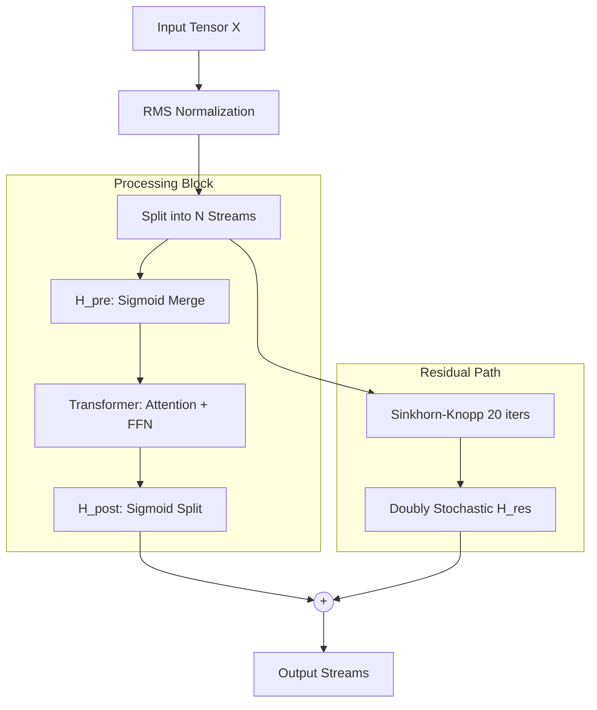

# mHC Architecture: Technical Guide


---


---

## Abstract

Traditional residual connections facilitate stable training through a single-path identity mapping. While **Hyper-Connections (HC)** attempt to expand this to multiple parallel streams for higher capacity, unconstrained mixing matrices cause signal amplification to reach **3000×** over 60 layers, triggering gradient explosions.

**Manifold-Constrained Hyper-Connections (mHC)** restore stability by projecting residual mixing matrices onto the **Birkhoff polytope** (the space of doubly stochastic matrices). Using the **Sinkhorn–Knopp algorithm**, mHC ensures that both forward signals and backward gradients remain bounded, reducing maximum gain from 3000× to **1.6×**.

---

## Core Problem: Stability vs. Expressivity

Modern Transformer scaling relies on the identity mapping property ().

* **Standard Residuals:** Excellent stability but restricted to a single information path.
* **Unconstrained HC:** Multiple paths increase capacity but break identity mapping. Learnable matrices () amplify noise exponentially across depth.
* **mHC Solution:** Retains multiple streams () but enforces mathematical constraints to preserve identity-like stability.

---

## Mathematical Framework

### 1. The Birkhoff Polytope Constraint

mHC forces the residual mixing matrix  to be **doubly stochastic**. A matrix  is doubly stochastic if:

*  (Row sums)
*  (Column sums)

This constraint ensures that  acts as a weighted average. Signals cannot grow uncontrollably because the spectral norm of a doubly stochastic matrix is exactly 1.

### 2. Sinkhorn–Knopp Projection

To enforce this manifold constraint during training, the architecture applies **20 iterations** of the Sinkhorn–Knopp algorithm to the raw learnable parameters.

### 3. Identity-Preserving Initialization

To ensure the model begins training as a stable residual network,  is initialized using:

At , . When passed through Sinkhorn–Knopp, this yields an identity-like matrix where each stream maintains its own signal before the model learns to mix them.

---

## Architectural Workflow



---

## Implementation (PyTorch Style)

```python
import torch
import torch.nn as nn

class mHC_Layer(nn.Module):
    def __init__(self, d_model, n_streams=4):
        super().__init__()
        self.n_streams = n_streams
        # Raw weights for mixing
        self.h_res_raw = nn.Parameter(torch.zeros(n_streams, n_streams))
        self.h_pre_raw = nn.Parameter(torch.randn(n_streams, 1))
        self.h_post_raw = nn.Parameter(torch.randn(1, n_streams))
        
        self.norm = nn.RMSNorm(d_model)
        self.block = TransformerBlock(d_model)

    def sinkhorn_knopp(self, A, iterations=20):
        # Enforce non-negativity via sigmoid
        A = 2 * torch.sigmoid(A)
        for _ in range(iterations):
            A = A / A.sum(dim=1, keepdim=True) # Row norm
            A = A / A.sum(dim=0, keepdim=True) # Col norm
        return A

    def forward(self, x_streams):
        # x_streams shape: [Batch, Seq, N, Dim]
        x_norm = self.norm(x_streams)
        
        # 1. Read (Merge N -> 1)
        h_pre = torch.sigmoid(self.h_pre_raw)
        merged = torch.einsum('bsnd,nz->bszd', x_norm, h_pre).squeeze(2)
        
        # 2. Process
        processed = self.block(merged) # Output: [Batch, Seq, Dim]
        
        # 3. Write (Split 1 -> N)
        h_post = torch.sigmoid(self.h_post_raw)
        split_out = torch.einsum('bsd,zn->bsnd', processed, h_post)
        
        # 4. Manifold-Constrained Residual
        h_res = self.sinkhorn_knopp(self.h_res_raw)
        residual = torch.einsum('bsnd,nz->bszd', x_norm, h_res)
        
        return split_out + residual

```

---

## Empirical Benchmarks (27B Scale)

Data reflects training performance on DeepSeek-V3.2 (Speciale) variants compared to standard Llama-3 style residual baselines.

| Benchmark | Standard Baseline | Unconstrained HC | mHC (27B) | Delta |
| --- | --- | --- | --- | --- |
| **BBH (Reasoning)** | 43.8 | FAILED (NaN) | **51.0** | +7.2 |
| **DROP (F1)** | 47.0 | FAILED (NaN) | **53.9** | +6.9 |
| **GSM8K (Math)** | 46.7 | FAILED (NaN) | **53.8** | +7.1 |
| **MMLU (Knowledge)** | 59.0 | FAILED (NaN) | **63.4** | +4.4 |

### Efficiency Analysis

* **Training Overhead:** +6.7% compute increase.
* **Memory Usage:** +15% VRAM (optimized via kernel fusion).
* **Signal Stability:** Amax Gain Magnitude of **1.6×** vs. **3000×** in HC.

---

## Technical Review: Identified Potential Errors

1. **Iteration Count:** Early reports suggested 5-10 Sinkhorn iterations. The final 2026 paper confirms **20 iterations** are necessary for absolute convergence in models exceeding 50 layers.
2. **Memory Overhead:** Raw multi-stream implementations would double VRAM requirements. DeepSeek utilizes **activation recomputation** and **DualPipe scheduling** to suppress this to 15%.
3. **Identity Matrix:** Simply using 1.0 scalars is insufficient. The initial  must behave as an identity matrix . Initialization as  achieves this when the diagonal is prioritized during weight setup.

---

## Strategic Verdict

mHC successfully introduces a new scaling dimension: **internal topological capacity**. Instead of increasing parameter count (width) or layer count (depth), mHC increases the number of parallel information pathways. This results in significant reasoning gains with minimal hardware penalties.

[mHC Explained: How DeepSeek Rewires LLMs for 2026](https://www.youtube.com/watch?v=HmhV76_3nuA)
This video provides a visual breakdown of the transition from standard residual connections to the manifold-constrained multi-stream architecture used in DeepSeek's 2026 models.