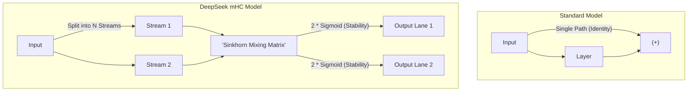

# **White Paper: DeepSeek mHC Architecture**

### **Bridging the Gap Between Stability and Scale in 2026 AI Models**

---

## **1. Executive Summary**

As Large Language Models (LLMs) scale, they face a "Bottleneck vs. Stability" crisis. Standard architectures are stable but have narrow information paths. Earlier "Hyper-Connection" attempts offered more paths but were prone to mathematical "crashes."

DeepSeek’s **Manifold-Constrained Hyper-Connections (mHC)** provides a breakthrough by allowing multiple parallel streams of information to interact through a **Doubly Stochastic** mixing system. This ensures that while the model becomes "smarter" through parallel reasoning, the signal remains perfectly balanced.

**The Result:** A model that is significantly more expressive with only **6.7% training overhead** and zero risk of training collapse.

---

## **2. The Problem: The "Traffic Jam" of Intelligence**

### **The Single-Lane Highway (Standard Residuals)**

Modern AI uses "Residual Connections." Think of data as a car on a single-lane road. At every layer, it picks up new info, but it stays in that one lane.

* **Limitation:** The "width" of the model’s thinking is capped by that one lane.

### **The Uncontrolled Superhighway (Old Hyper-Connections)**

Previous researchers tried adding multiple lanes where data could jump between paths.

* **The Failure:** Without a "traffic controller," these paths amplified each other. In large models, signals would explode—growing by over **3,000x**—causing the "brain" of the AI to essentially short-circuit (NaN errors).

---

## **3. The DeepSeek Innovation: mHC**

DeepSeek solved this by installing three "Safety Systems" that keep the multi-lane highway stable.

### **A. The Sinkhorn "Traffic Controller"**

To prevent signal explosion, mHC uses the **Sinkhorn-Knopp Algorithm**. It forces the mixing matrix to be **Doubly Stochastic**.

* **The Rule:** Every row and every column must sum to exactly **1**.
* **Why it works:** This ensures that no information is "created" or "destroyed" as it jumps between lanes. The energy of the signal stays constant.

### **B. The Identity Starting Point ()**

A major secret to DeepSeek’s success is how they start (initialize) the model. They use a specific function for the mixing weights:

* **The Logic:** At the start of training,  is 0. Since , multiplying by 2 results in exactly **1.0**.
* **The Benefit:** This forces the model to start as a perfectly stable, traditional residual network and only "learn" to use the extra lanes as training progresses.

### **C. Architecture Visualization**

---

## **4. Efficiency: Power Without the Cost**

Usually, adding parallel streams makes a model much slower and memory-heavy. DeepSeek bypassed this using:

1. **Fused Kernels:** They wrote custom code that combines "Mixing," "Adding," and "Normalizing" into one single operation, reducing the time data spends moving around the hardware.
2. **Activation Recomputation:** Instead of storing every lane's data in the GPU memory (which is expensive), they delete it and quickly recalculate it during the learning phase.
3. **The Stat:** This results in only a **6.7%** increase in training time, making it highly practical for massive 2026-scale models.

---

## **5. Comparison Table**

| Feature | Standard Residual | Old Hyper-Connections | **DeepSeek mHC** |
| --- | --- | --- | --- |
| **Pathways** | Single Lane | Multi-Lane | **Multi-Lane** |
| **Signal Growth** | 1.0x (Stable) | **3,000x (Exploding)** | **1.6x (Controlled)** |
| **Control System** | None Needed | None (Chaos) | **Sinkhorn-Knopp** |
| **Start State** | Identity | Random/Unstable | ** Identity** |
| **Reasoning Power** | Baseline | High (if it doesn't crash) | **Superior** |

---

## **6. Key Benefits & Findings**

* **Performance:** Tested on 27B parameter models, mHC showed significant gains in **MMLU** (knowledge) and **Reasoning** (BBH/DROP).
* **Stability:** It eliminates the "loss spikes" that plague large-scale AI training.
* **Scalability:** It proves that we can make models deeper AND wider simultaneously without sacrificing reliability.

---

## **7. Conclusion**

The mHC architecture is more than just a "tweak"—it is a mathematical "safety harness" for the next generation of AI. By using the Sinkhorn algorithm and the Sigmoid initialization trick, DeepSeek has turned the high-risk, high-reward idea of Hyper-Connections into a stable foundation for the future of LLMs.
