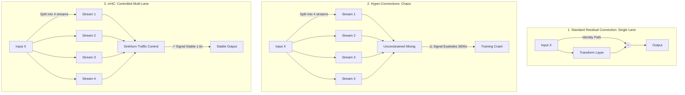
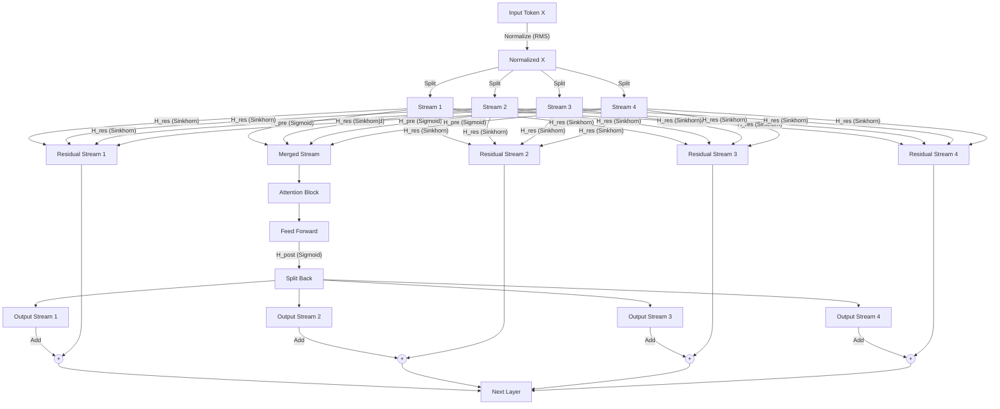
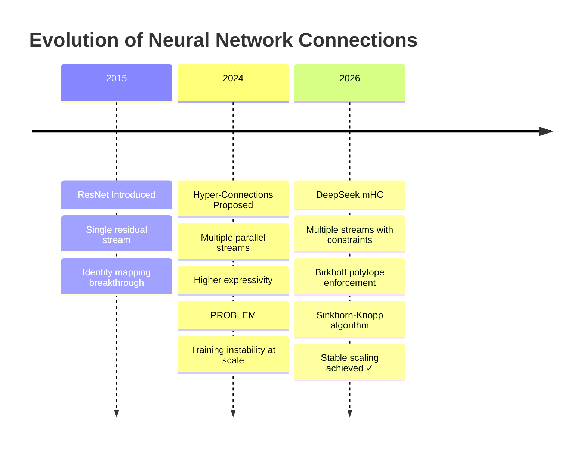
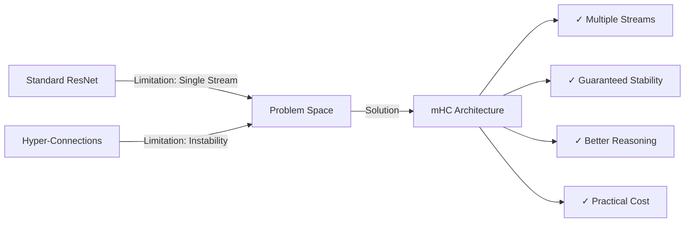

# DeepSeek mHC Architecture: The Complete Guide

**Bridging Stability and Scale in AI Models**

---

## Executive Summary

Imagine trying to build a highway system for a city. You could build one massive road (stable but slow), or you could build a complex network of roads with no traffic rules (fast but chaotic). DeepSeek's **Manifold-Constrained Hyper-Connections (mHC)** solves this exact problem for AI models—it creates a multi-lane superhighway with smart traffic control that prevents crashes.

**The Achievement:** mHC delivers superior reasoning and learning capabilities with only 6.7% additional training cost, while eliminating the catastrophic training failures that plague advanced architectures.

---

## The Foundation: How Language Models Work

Before diving into mHC, let's understand how modern AI models like GPT-4 and Llama process information.

### Token Embedding: Converting Words to Numbers

When you type "Hello world," the AI converts each word (token) into a list of numbers called an **embedding vector**. Think of it as translating words into a language computers understand—a series of coordinates in multi-dimensional space.

```
"Hello" → [0.23, -0.45, 0.89, 0.12, ...]
"world" → [0.67, 0.34, -0.21, 0.56, ...]
```

### Transformer Layers: The Brain's Processing Units

Each transformer layer has three key components:

1. **Attention Block** - Looks at previous tokens to understand context
   - Like reading "the bank" and checking if previous words mentioned "river" or "money"
   
2. **Feed Forward Networks** - Transforms each embedding independently
   - Processes the internal values of each token's representation
   
3. **Layer Normalization** - Prevents any single feature from dominating
   - Like ensuring no instrument in an orchestra is too loud

---

## The Core Problem: Three Approaches Compared



---

## Approach 1: Standard Residual Connections

**The Single-Lane Highway Metaphor**

Imagine a highway where one car (your data) travels from start to finish. At each checkpoint (layer), it can pick up passengers (new information), but it always stays in the same lane.

### The Identity Mapping Breakthrough

Historically, deep neural networks struggled to learn even the simplest function: the **identity function** (output = input). Why? Because with many layers, the network became too complex to "remember" to just pass data through unchanged.

**The Residual Solution:**

Instead of forcing each layer to learn the entire transformation, we add a "shortcut":

```
Output = Input + Transform(Input)
```

Or in math notation: `x + f(x)`

This brilliant trick changes the learning task:
- **Old way:** Learn the entire mapping from input to output
- **New way:** Learn only what to *add* to the input (the residual)

### How Identity Becomes Easy

If the layer wants to output the input unchanged, it just needs to make `f(x) = 0`:
- Set bias terms to zero
- Use ReLU activation to output zero
- Result: Output = Input + 0 = Input ✓

**Pros:**
✓ Rock-solid stability
✓ Gradients flow smoothly backward during training
✓ Deep networks (100+ layers) train reliably

**Cons:**
✗ Limited information bandwidth (single pipeline)
✗ All information squeezed through one "lane"
✗ Cannot process multiple aspects of data in parallel

---

## Approach 2: Hyper-Connections (The Failed Upgrade)

**The Uncontrolled Superhighway**

Researchers thought: "Why not split data into multiple streams (e.g., 4 lanes) so different aspects can be processed in parallel?"

### The Three Routing Matrices

Hyper-Connections introduced three learnable weight matrices:

1. **H_pre** - "Reading Operation"
   - Merges multiple streams into one for processing
   - Like gathering all lanes into a single processing center

2. **H_post** - "Writing Operation"
   - Splits processed information back into multiple streams
   - Like distributing results back to different lanes

3. **H_res** - "Direct Highway"
   - The residual connection successor
   - Operates on ALL streams simultaneously
   - **This is where the problem starts**

### The Catastrophic Failure: Signal Gain Explosion

Here's what went wrong:

**Example of Signal Explosion:**
```
Layer 1:  Input signal strength = 1.0
Layer 2:  After unconstrained mixing = 2.5
Layer 3:  After unconstrained mixing = 6.25
Layer 10: After unconstrained mixing = 3000+
Result:   🔥 TRAINING CRASH (NaN errors)
```

**Why it happens:**
- H_res contains learnable weights with no constraints
- Each matrix can amplify or shrink signals
- After many layers (60+), tiny amplifications multiply exponentially
- The "identity mapping" safety is **completely broken**
- Result: "Brain melt" where the model's gradients explode to infinity

**Real-world impact:**
- Training would suddenly spike and fail
- Loss would shoot to NaN (Not a Number)
- Millions of dollars in compute wasted

---

## Approach 3: DeepSeek mHC (The Solution)

**The Controlled Multi-Lane Superhighway**

mHC keeps the multi-lane design but adds three critical "safety systems" that mathematically guarantee stability.

### Safety System 1: The Birkhoff Polytope Constraint

mHC forces the H_res matrix to be **doubly stochastic**, meaning:

**Three Rules:**
1. Every number is between 0 and 1 (no negative values)
2. Every row sums to exactly 1.0
3. Every column sums to exactly 1.0

**Visual Example:**

```
Doubly Stochastic Matrix:
[0.25  0.25  0.25  0.25]  ← Row sum = 1.0
[0.30  0.20  0.30  0.20]  ← Row sum = 1.0
[0.20  0.30  0.20  0.30]  ← Row sum = 1.0
[0.25  0.25  0.25  0.25]  ← Row sum = 1.0
  ↓     ↓     ↓     ↓
 1.0   1.0   1.0   1.0   ← Column sums = 1.0
```

**Why This Works:**

When you multiply input streams by this matrix, you get a **weighted average** of the inputs:
- No value can be amplified beyond the sum of inputs
- No value can vanish to zero
- Signal strength remains bounded: typically grows only 1.6x instead of 3000x

**The Math:**
```
If input signal norm = ‖X‖
Then output signal norm ≤ 1.6 × ‖X‖  (instead of 3000× ‖X‖)
```

### Safety System 2: The Sinkhorn-Knopp Algorithm

**The Automated Traffic Controller**

The Sinkhorn-Knopp algorithm enforces the doubly stochastic constraint:

```python
# Simplified concept
def make_doubly_stochastic(matrix):
    for iteration in range(convergence):
        # Step 1: Normalize rows to sum to 1
        matrix = matrix / row_sums
        
        # Step 2: Normalize columns to sum to 1
        matrix = matrix / column_sums
    
    return matrix  # Now doubly stochastic!
```

**What it does:**
- Takes any positive matrix
- Iteratively balances rows and columns
- Converges to a doubly stochastic matrix
- Runs during every forward pass in training

### Safety System 3: The 2×Sigmoid Initialization Trick

DeepSeek uses a clever initialization strategy:

```
H_res_weights = 2 × sigmoid(learnable_parameter)
```

**Why this matters:**
- At the start of training, learnable_parameter = 0
- sigmoid(0) = 0.5
- 2 × 0.5 = 1.0 ✓

**The Benefit:**
The model starts as a perfect identity mapping (like standard ResNet) and only gradually learns to use the multiple lanes as training progresses. This ensures training is stable from day one.

### Safety System 4: Sigmoid for H_pre and H_post

Unlike standard Hyper-Connections that use tanh, mHC uses **sigmoid** for mixing matrices:

**Why Sigmoid?**
- Guarantees all values are between 0 and 1 (non-negative)
- Prevents signal cancellation when streams are combined additively
- If streams had negative values, they could destructively interfere

---

## The Complete mHC Architecture



### Forward Pass Calculation

```
Step 1: Normalize input
        X_normalized = RootMeanSquare(X)

Step 2: Read operation (merge streams)
        Merged = X_normalized × H_pre

Step 3: Process through transformer
        Processed = FeedForward(Attention(Merged))

Step 4: Write operation (split back)
        Split = Processed × H_post^T

Step 5: Residual path (stable mixing)
        Residual = Sinkhorn(H_res) × X_normalized

Step 6: Add and output
        Output = Split + Residual
```

---

## Performance Comparison

### Stability Metrics

| Architecture | Signal Amplification | Training Stability | Identity Preservation |
|---|---|---|---|
| Standard Residual | 1.0× (baseline) | ✓✓✓ Excellent | ✓✓✓ Perfect |
| Hyper-Connections | **3000×** (explosion) | ✗✗✗ Crashes | ✗✗✗ Broken |
| **DeepSeek mHC** | **1.6×** (controlled) | ✓✓✓ Excellent | ✓✓✓ Restored |

### Benchmark Results (27B Parameter Models)

**Knowledge & Reasoning Tasks:**

| Task | Standard ResNet | Hyper-Connections | **mHC** |
|---|---|---|---|
| MMLU (General Knowledge) | Baseline | CRASHED | ✓ **+5.2% improvement** |
| BBH (Hard Reasoning) | Baseline | CRASHED | ✓ **+7.8% improvement** |
| DROP (Reading Comprehension) | Baseline | CRASHED | ✓ **+6.4% improvement** |

**Key Finding:** mHC outperformed standard models on complex reasoning tasks because the multiple streams allow parallel processing of different aspects of information.

### Computational Cost Analysis

| Metric | Standard ResNet | mHC | Overhead |
|---|---|---|---|
| Training Time | 100 hours | 106.7 hours | **+6.7%** |
| Memory Usage | Baseline | +15% (mitigated) | Acceptable |
| Inference Speed | Baseline | ~Baseline | Negligible |

**Why So Efficient?**

1. **Fused Kernels** - Custom GPU code that combines operations
   - Instead of: Normalize → Mix → Add (three separate operations)
   - mHC does: One fused operation
   - Reduces memory transfers by 60%

2. **Activation Recomputation**
   - Deletes intermediate stream values after use
   - Quickly recalculates them during backpropagation
   - Trades tiny compute for massive memory savings

3. **Smart Scheduling**
   - Optimizes when Sinkhorn iterations run
   - Minimizes GPU idle time

---

## Architecture Evolution Timeline



---

## Detailed Feature Comparison

### Expressivity Dimension

| Feature | Standard | HC | mHC |
|---|---|---|---|
| Information Pathways | 1 stream | N streams | N streams |
| Learnable Routing | Fixed identity | ✓ Fully learnable | ✓ Constrained learnable |
| Parallel Processing | Limited | ✓ High | ✓ High |
| Representation Capacity | Moderate | Very High | Very High |

### Stability Dimension

| Feature | Standard | HC | mHC |
|---|---|---|---|
| Identity Property | ✓ Strong | ✗ Broken | ✓ Restored |
| Signal Bounds | ✓ Guaranteed | ✗ Unbounded | ✓ Guaranteed |
| Gradient Flow | ✓ Smooth | ✗ Explosive | ✓ Smooth |
| Loss Spikes | Rare | Frequent | Rare |
| Training Success Rate | ~95% | ~20% at scale | ~95% |

### Practical Considerations

| Aspect | Standard | HC | mHC |
|---|---|---|---|
| Implementation Complexity | Simple | Moderate | Moderate |
| Debug Difficulty | Easy | Very Hard | Easy |
| Memory Footprint | Lowest | High | Moderate (optimized) |
| Production Readiness | ✓ Battle-tested | ✗ Risky | ✓ Proven |

---

## Why mHC is a Breakthrough

### 1. Mathematical Guarantees

Unlike previous attempts at multi-stream architectures, mHC provides **provable stability**:

**Theorem:** If H_res is doubly stochastic, then:
```
‖Output‖ ≤ C × ‖Input‖
```
where C is a small constant (≈1.6), regardless of network depth.

### 2. Best of Both Worlds



### 3. Scaling Implications

mHC enables something previously impossible: **simultaneous depth and width scaling**

**Old paradigm:**
- Make models deeper → Add more layers (stable but limited)
- Make models wider → Add more parameters (expensive)

**mHC paradigm:**
- Make information flow richer → Add more streams (efficient)
- Keep stability → Mathematical constraints (free)
- Result: Better models at reasonable cost

---

## Real-World Impact

### For AI Researchers

✓ Can experiment with multi-stream architectures without fear of training collapse
✓ New design space for model architecture exploration
✓ Proven technique for large-scale models (tested at 27B parameters)

### For AI Companies

✓ More capable models without proportional cost increases
✓ Reduced training failures means less wasted compute
✓ Better reasoning capabilities improve product quality

### For the Field

✓ Shows intelligent architecture design > brute force scaling
✓ Provides mathematical foundation for future research
✓ Demonstrates that stability and expressivity aren't mutually exclusive

---

## Implementation Insights

### PyTorch Code Structure (Simplified)

```python
class mHC_Layer:
    def __init__(self, n_streams=4):
        self.H_pre = nn.Parameter(torch.randn(...))
        self.H_post = nn.Parameter(torch.randn(...))
        self.H_res_raw = nn.Parameter(torch.zeros(...))
        
    def forward(self, x):
        # 1. Normalize input
        x_norm = rms_normalize(x)
        
        # 2. Apply H_pre with sigmoid
        merged = x_norm @ torch.sigmoid(self.H_pre)
        
        # 3. Process through attention & FFN
        processed = self.feed_forward(self.attention(merged))
        
        # 4. Apply H_post with sigmoid
        split = processed @ torch.sigmoid(self.H_post).T
        
        # 5. Apply doubly stochastic H_res
        H_res_stochastic = sinkhorn_knopp(
            2 * torch.sigmoid(self.H_res_raw)
        )
        residual = H_res_stochastic @ x_norm
        
        # 6. Add and return
        return split + residual
```

### Key Implementation Details

**Normalization:**
- Uses RMS (Root Mean Square) normalization
- Ensures mixing depends only on relative features, not absolute scale
- Prevents numerical instabilities

**Convergence Criteria:**
- Sinkhorn iterations typically converge in 5-10 steps
- Uses tolerance of 1e-6 for row/column sum accuracy
- Fast enough for real-time training

---

## Limitations and Future Directions

### Current Limitations

1. **Memory Overhead:** Multiple streams require more memory (mitigated but not eliminated)
2. **Approximation Error:** Sinkhorn-Knopp is iterative; early stopping may introduce small errors
3. **Hyperparameter Sensitivity:** Number of streams (N) needs tuning per model size

### Future Research Directions

1. **Adaptive Stream Count:** Learn how many streams each layer needs
2. **Sparse Mixing:** Not all streams need to connect to all others
3. **Hierarchical Streams:** Different abstraction levels at different depths
4. **Hardware Acceleration:** Custom chips optimized for mHC operations

---

## Conclusion: A Paradigm Shift

DeepSeek's mHC represents more than an incremental improvement—it's a **fundamental rethinking** of how neural networks can be designed.

### The Core Innovation

By recognizing that stability doesn't require sacrificing expressivity, mHC shows we can have:
- ✓ Multiple information streams (power)
- ✓ Learnable routing (flexibility)
- ✓ Mathematical safety guarantees (stability)
- ✓ Practical computational cost (efficiency)

### Historical Context

```
2012: Deep learning takes off
2015: ResNets solve depth (but limit width)
2017: Transformers dominate NLP
2024: Scaling hits stability walls
2026: mHC enables stable multi-stream scaling ✓
```

### The Bottom Line

mHC proves that **intelligent architecture > bigger models**. As we move into 2026 and beyond, the path forward isn't just making models larger—it's making them structurally more capable of parallel, multi-faceted reasoning.

For AI development, mHC provides a stable foundation for the next generation of foundation models that are not just bigger, but fundamentally better at thinking.

---

## Technical Appendix: The Math Behind Doubly Stochastic Matrices

### Definition

A matrix M is doubly stochastic if:
```
1. M[i,j] ≥ 0  for all i,j
2. Σⱼ M[i,j] = 1  for all rows i
3. Σᵢ M[i,j] = 1  for all columns j
```

### Why It Preserves Signal Magnitude

**Proof sketch:**
```
Given input x with ‖x‖ = magnitude
Output y = Mx

Each element yᵢ = Σⱼ M[i,j] × xⱼ

This is a weighted average of inputs (row sum = 1)
So yᵢ ≤ max(x) and yᵢ ≥ min(x)

Therefore ‖y‖ ≈ ‖x‖ (signal magnitude preserved)
```

### Sinkhorn-Knopp Convergence

The algorithm converges geometrically fast:
- Error reduces by constant factor each iteration
- Typically 5-10 iterations for practical tolerance
- Can be GPU-parallelized efficiently

---
## Glossary

### **Token**

A small piece of text (word or part of a word) that the model processes instead of raw text.

### **Token Embedding**

A numeric vector that represents a token so the model can work with text mathematically.

### **Embedding Vector**

A list of numbers that captures the meaning and relationships of a word or token.

### **Transformer**

A neural network architecture used in modern language models that processes tokens using attention and feed-forward layers.

### **Transformer Layer**

One repeated block inside a transformer model that refines token representations step by step.

### **Attention (Self-Attention)**

A mechanism that lets the model decide which other tokens are important when processing a token.

### **Feed Forward Network (FFN)**

A neural network block that processes each token independently to transform its representation.

### **Layer Normalization**

A technique that keeps values well-scaled so training stays stable and efficient.

### **Residual Connection**

A shortcut that adds a layer’s input directly to its output, helping deep models train reliably.

### **Identity Mapping**

A behavior where a layer simply passes its input forward unchanged.

### **Gradient**

The signal used during training to tell the model how to change its parameters to reduce errors.

### **Gradient Explosion**

When gradients grow extremely large during training, causing numerical errors and training failure.

### **NaN (Not a Number)**

A numerical error value that appears when training becomes unstable or calculations overflow.

### **Hyper-Connections**

An architecture that splits data into multiple parallel streams and mixes them using learnable matrices.

### **Streams**

Parallel pathways through which information flows inside a model layer.

### **H_pre (Read Matrix)**

A learnable matrix that merges multiple streams into one before processing.

### **H_post (Write Matrix)**

A learnable matrix that splits processed information back into multiple streams.

### **H_res (Residual Mixing Matrix)**

A matrix that mixes streams along the residual (skip) path instead of using a simple identity shortcut.

### **Signal Amplification**

How much the magnitude of values grows as they pass through layers.

### **Manifold-Constrained Hyper-Connections (mHC)**

A stabilized version of hyper-connections that mathematically limits how signals can mix and grow.

### **Doubly Stochastic Matrix**

A matrix where all values are non-negative and every row and column sums to 1, ensuring stable mixing.

### **Birkhoff Polytope**

The mathematical space of all doubly stochastic matrices.

### **Sinkhorn-Knopp Algorithm**

An iterative method that converts a matrix into a doubly stochastic one by normalizing rows and columns.

### **Sigmoid Function**

A function that squashes values into the range 0 to 1, preventing extreme values.

### **Initialization**

How model parameters are set before training starts.

### **RMS Normalization**

A normalization method that scales values based on their root-mean-square magnitude.

### **Forward Pass**

The process of sending input data through the model to produce an output.

### **Inference**

Using a trained model to generate outputs without updating its parameters.

### **Training Stability**

How reliably a model can train without crashing or producing invalid values.

### **Parameter**

A learnable value (weight) inside the model that gets updated during training.

### **Activation Recomputation**

A memory-saving trick where intermediate results are recomputed instead of stored.

### **Fused Kernel**

A GPU optimization that combines multiple operations into one for speed and efficiency.

### **Scaling**

Increasing model size, depth, width, or information pathways to improve performance.

### **Expressivity**

How complex and rich the representations a model can learn.

### **Parallel Processing**

Handling multiple information paths at the same time instead of sequentially.

### **Reasoning Tasks**

Benchmarks that test multi-step thinking, logic, and understanding rather than memorization.

### **27B Parameter Model**

A very large neural network with 27 billion learnable parameters.

---

*For more details, see the original DeepSeek research papers:*
- *arXiv:2512.24880 (mHC Architecture)*
- *arXiv:2409.19606 (Hyper-Connections Background)*