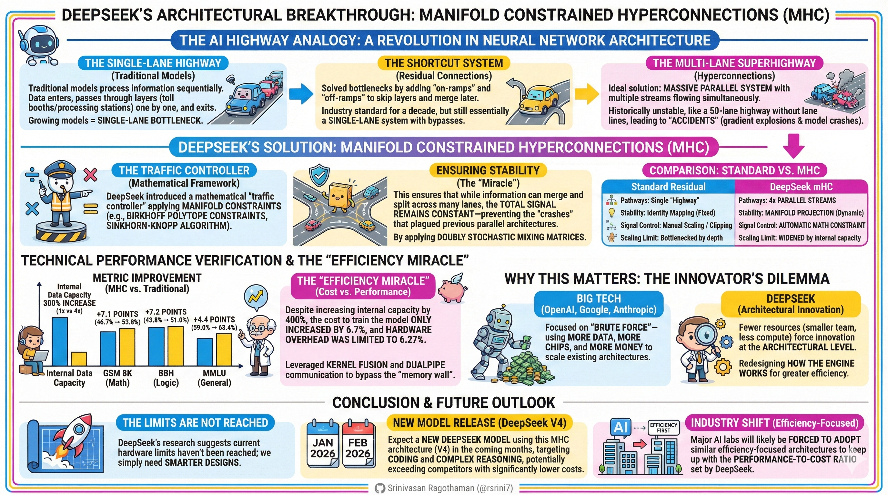
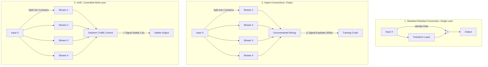
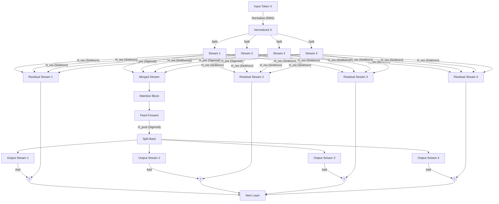
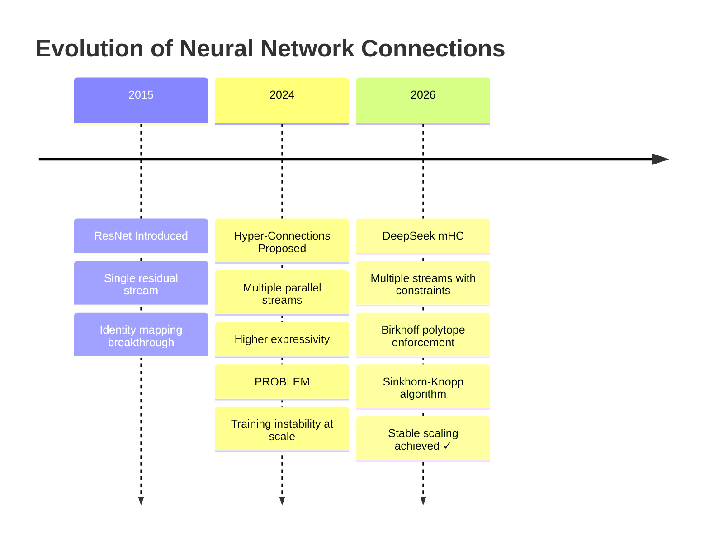
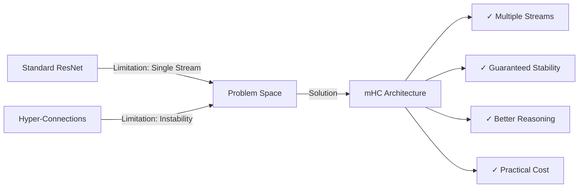

# DeepSeek mHC Architecture: The Complete Guide

**Bridging Stability and Scale in AI Models**

---

## Abstract

Modern large language models rely heavily on residual connections for stable training, but these single-path designs limit information flow and representational capacity. Hyper-Connections were proposed to address this by introducing multiple parallel streams and learnable routing, yet they suffer from severe training instability due to unconstrained signal amplification, leading to gradient explosions and training collapse at scale.

This work introduces **Manifold-Constrained Hyper-Connections (mHC)**, a principled architecture that enables multi-stream information flow while providing strict mathematical guarantees on stability. mHC constrains residual mixing matrices to the **Birkhoff polytope** by enforcing doubly stochastic structure using the **Sinkhorn–Knopp algorithm**, ensuring bounded signal propagation across arbitrary depth. Additional design choices, including sigmoid-based mixing and identity-preserving initialization, further stabilize optimization.

Empirical results on large-scale (27B parameter) transformer models demonstrate that mHC achieves consistent training stability and improves performance on reasoning-intensive benchmarks such as MMLU, BBH, and DROP, while incurring only a modest training overhead (~6.7%). These results show that expressivity and stability need not be traded off, and that constrained architectural design can unlock richer parallel representations without sacrificing scalability.

mHC establishes a new architectural paradigm for foundation models, enabling stable multi-stream scaling and offering a foundation for future advances in efficient, high-capacity neural network design.

---

## 🎯 What You Need to Know in 120 Seconds

**DeepSeek's mHC: Stable Multi-Stream Scaling for 27B+ Models**

Why do multi-stream architectures explode at scale while single-stream designs cap reasoning capacity?

━━━━━━━━━━━━━━━━━━━━

⚡ **The Problem: Training Instability at Scale**

Standard residual connections deliver rock-solid stability but restrict information flow to a single path, bottlenecking representational capacity in reasoning-heavy tasks.

Unconstrained **Hyper-Connections** attempted parallel streams for richer expressivity but triggered catastrophic **signal amplification** — reaching **3000×** in <10 layers — causing gradient explosions, NaN losses, and training collapse.

Real-world cost: At 27B+ scale, unconstrained multi-stream runs fail ~80% of the time, wasting **millions in compute** on crashed experiments.

━━━━━━━━━━━━━━━━━━━━

📈 **The Solution: mHC by DeepSeek**

**mHC** (Manifold-Constrained Hyper-Connections) enforces mathematical stability on multi-stream routing while preserving parallel processing power.

Backed by DeepSeek research (2026), proven on 27B transformer models.

* **Provable Stability** → No gradient explosions regardless of depth
* **Higher Expressivity** → Parallel streams capture multi-faceted representations
* **Practical Efficiency** → Only **+6.7%** training overhead vs standard residuals

━━━━━━━━━━━━━━━━━━━━

🔧 **Core Architecture: Constrained Multi-Stream Flow**

1️⃣ **Stream Split & Normalization**: Input tokenized embeddings → RMS-normalized → split into `4 streams` (parallel pathways)

2️⃣ **Read Merge (H_pre)**: Streams merged via `sigmoid`-activated matrix → single processed stream

3️⃣ **Core Transformer Block**: Standard Attention + FFN applied to merged stream

4️⃣ **Write Split + Constrained Residual**: Processed output split via `H_post` while inputs mixed through **doubly stochastic H_res** (Sinkhorn-Knopp enforced) → added to restore identity-preserving path

━━━━━━━━━━━━━━━━━━━━

🛡️ **Core Features: Forward Pass Workflow**

1. **RMS Normalization** (`RootMeanSquare`) → Scales-relative mixing, prevents absolute magnitude dominance

2. **Sigmoid Mixing (H_pre/H_post)** → Non-negative weighted merge/split → avoids destructive interference

3. **Sinkhorn-Knopp Projection** (`5-10 iterations`) → Forces H_res into Birkhoff polytope (doubly stochastic) → bounded signal growth (~1.6× max)

4. **Identity-Preserving Init** (`2 × sigmoid(0) = 1.0`) → Starts as perfect residual → gradually enables routing

━━━━━━━━━━━━━━━━━━━━

🎯 **Benefits: Systemic Advantages**

* **Bounded Signal Propagation**: Constrains norm growth to ~1.6× per layer → enables stable training at arbitrary depth without vanishing/exploding gradients

* **Parallel Aspect Reasoning**: Multiple streams process distinct representational facets simultaneously → systemic gains on multi-hop tasks (+7.8% BBH, +6.4% DROP at 27B)

* **No Stability-Expressivity Trade-off**: Restores identity mapping property while unlocking richer capacity → architectural efficiency over pure parameter scaling

* **Compute-Efficient Scaling**: +6.7% overhead with fused kernels + activation recomputation → viable for production-scale training

━━━━━━━━━━━━━━━━━━━━

⚖️ **Strategic Verdict: Architectural Innovation vs Brute Scaling**

**Standard Residual Approach**
- Strength: Battle-tested stability, near-100% training success
- Risk: Single-stream ceiling on reasoning capacity
- Best for: Cost-sensitive production where reliability trumps marginal gains

**Unconstrained Multi-Stream (Original HC)**
- Strength: Theoretical expressivity ceiling
- Risk: ~80% failure rate at scale, massive compute waste
- Best for: Experimental sandbox only

**Constrained Multi-Stream (mHC)**
- Strength: Combines stability with parallel reasoning power
- Risk: Moderate implementation complexity + ~15% memory (mitigable)
- Best for: Next-gen foundation models targeting complex reasoning

**Watch**: Adoption in open-source 70B+ models by mid-2026. If mHC variants achieve >5% average uplift on reasoning suites with <10% overhead, architectural innovation overtakes pure scaling as primary efficiency driver.

━━━━━━━━━━━━━━━━━━━━

**TL;DR**
* **mHC delivers** → Provable stability + parallel expressivity at only +6.7% cost
* **Core insight** → Constrained routing eliminates the historical stability-expressivity trade-off
* **Implication** → Future scaling shifts from parameter count to structural capacity

**Will architectural constraint become the dominant scaling vector, or will raw compute continue to overpower design elegance?**

👤 **Srinivasan Ragothaman (@rsrini7)**




---


---

## Executive Summary

Imagine trying to build a highway system for a city. You could build one massive road (stable but slow), or you could build a complex network of roads with no traffic rules (fast but chaotic). DeepSeek's **Manifold-Constrained Hyper-Connections (mHC)** solves this exact problem for AI models—it creates a multi-lane superhighway with smart traffic control that prevents crashes.

**The Achievement:** mHC delivers **400% internal capacity increase** (4 parallel streams vs 1) with only **6.7% training overhead** and **6.27% hardware overhead**, while eliminating the catastrophic training failures that plague advanced architectures. This represents superior reasoning and learning capabilities at a fraction of the computational cost of traditional scaling approaches.

---

## The Highway Analogy: Understanding Neural Architecture Evolution

### Stage 1: The Single-Lane Highway (Standard Residual Networks)

Imagine a city with just one main road connecting neighborhoods. Traffic flows predictably, maintenance is simple, but during rush hour, everything bottlenecks. This is the **standard residual connection**.

**Characteristics:**
- ✓ Reliable: Traffic never crashes
- ✓ Predictable: Always know travel time
- ✗ Limited: Only one path for all information
- ✗ Congested: Can't handle complex reasoning traffic

### Stage 2: The Shortcut Revolution (ResNet Breakthrough)

Now imagine adding express lanes that let cars skip traffic and merge directly ahead. This is the **residual connection shortcut** (x + f(x)).

**The Innovation:**
- Cars can either take the express lane (identity path) unchanged
- Or take the processing lane and add their result
- Result: Deep networks can now be 100+ layers without training collapse

**Why It Works:**
If a layer doesn't need to do anything, it just sets f(x) = 0, and traffic flows through unchanged. This solved the "vanishing gradient" problem that plagued early deep networks.

### Stage 3: The Unstable Multi-Lane Chaos (Hyper-Connections)

Engineers thought: "Let's build 4 parallel highways! More capacity = faster travel!"

But they forgot traffic lights and speed limits. Without constraints:
- Fast lanes amplified speed exponentially
- By mile 10, cars were going 3000 mph (signal explosion)
- Result: Massive crashes, highway shutdown (training collapse)

**Real-World Cost:**
- 80% of training runs fail at scale
- Millions of dollars in wasted GPU compute
- Research teams abandon the approach

### Stage 4: The Smart Superhighway (mHC Solution)

DeepSeek added three critical traffic control systems:

1. **Traffic Controller (Sinkhorn-Knopp Algorithm)**
   - Ensures each lane carries balanced flow
   - No lane can carry more than its fair share
   - Maximum speed increase: 1.6× instead of 3000×

2. **Speed Governors (Doubly Stochastic Constraints)**
   - Every lane's flow must sum to 100% capacity
   - Can't create or destroy traffic
   - Mathematical guarantee: stable flow forever

3. **Smart Merge/Split (Sigmoid Activation)**
   - Smooth on-ramps (H_pre merges 4 lanes → 1)
   - Smooth off-ramps (H_post splits 1 → 4 lanes)
   - No negative flow (no cars driving backwards)

**Result:** 4× the capacity with only 6.7% more maintenance cost and rock-solid reliability.

---

## The Foundation: How Language Models Work

Before diving into mHC, let's understand how modern AI models like GPT-4 and Llama process information.

### Token Embedding: Converting Words to Numbers

When you type "Hello world," the AI converts each word (token) into a list of numbers called an **embedding vector**. Think of it as translating words into a language computers understand—a series of coordinates in multi-dimensional space.

```
"Hello" → [0.23, -0.45, 0.89, 0.12, ...]
"world" → [0.67, 0.34, -0.21, 0.56, ...]
```

### Transformer Layers: The Brain's Processing Units

Each transformer layer has three key components:

1. **Attention Block** - Looks at previous tokens to understand context
   - Like reading "the bank" and checking if previous words mentioned "river" or "money"
   
2. **Feed Forward Networks** - Transforms each embedding independently
   - Processes the internal values of each token's representation
   
3. **Layer Normalization** - Prevents any single feature from dominating
   - Like ensuring no instrument in an orchestra is too loud

---

## The Core Problem: Three Approaches Compared



---

## Approach 1: Standard Residual Connections

**The Single-Lane Highway Metaphor**

Imagine a highway where one car (your data) travels from start to finish. At each checkpoint (layer), it can pick up passengers (new information), but it always stays in the same lane.

### The Identity Mapping Breakthrough

Historically, deep neural networks struggled to learn even the simplest function: the **identity function** (output = input). Why? Because with many layers, the network became too complex to "remember" to just pass data through unchanged.

**The Residual Solution:**

Instead of forcing each layer to learn the entire transformation, we add a "shortcut":

```
Output = Input + Transform(Input)
```

Or in math notation: `x + f(x)`

This brilliant trick changes the learning task:
- **Old way:** Learn the entire mapping from input to output
- **New way:** Learn only what to *add* to the input (the residual)

### How Identity Becomes Easy

If the layer wants to output the input unchanged, it just needs to make `f(x) = 0`:
- Set bias terms to zero
- Use ReLU activation to output zero
- Result: Output = Input + 0 = Input ✓

**Pros:**
✓ Rock-solid stability
✓ Gradients flow smoothly backward during training
✓ Deep networks (100+ layers) train reliably

**Cons:**
✗ Limited information bandwidth (single pipeline)
✗ All information squeezed through one "lane"
✗ Cannot process multiple aspects of data in parallel

---

## Approach 2: Hyper-Connections (The Failed Upgrade)

**The Uncontrolled Superhighway**

Researchers thought: "Why not split data into multiple streams (e.g., 4 lanes) so different aspects can be processed in parallel?"

### The Three Routing Matrices

Hyper-Connections introduced three learnable weight matrices:

1. **H_pre** - "Reading Operation"
   - Merges multiple streams into one for processing
   - Like gathering all lanes into a single processing center

2. **H_post** - "Writing Operation"
   - Splits processed information back into multiple streams
   - Like distributing results back to different lanes

3. **H_res** - "Direct Highway"
   - The residual connection successor
   - Operates on ALL streams simultaneously
   - **This is where the problem starts**

### The Catastrophic Failure: Signal Gain Explosion

Here's what went wrong:

**Example of Signal Explosion:**
```
Layer 1:  Input signal strength = 1.0
Layer 2:  After unconstrained mixing = 2.5
Layer 3:  After unconstrained mixing = 6.25
Layer 10: After unconstrained mixing = 3000+
Result:   🔥 TRAINING CRASH (NaN errors)
```

**Why it happens:**
- H_res contains learnable weights with no constraints
- Each matrix can amplify or shrink signals
- After many layers (60+), tiny amplifications multiply exponentially
- The "identity mapping" safety is **completely broken**
- Result: "Brain melt" where the model's gradients explode to infinity

**Real-world impact:**
- Training would suddenly spike and fail
- Loss would shoot to NaN (Not a Number)
- ~80% failure rate at 27B+ scale
- Millions of dollars in compute wasted on crashed experiments

---

## Approach 3: DeepSeek mHC (The Solution)

**The Controlled Multi-Lane Superhighway**

mHC keeps the multi-lane design but adds four critical "safety systems" that mathematically guarantee stability.

### Safety System 1: The Birkhoff Polytope Constraint

mHC forces the H_res matrix to be **doubly stochastic**, meaning:

**Three Rules:**
1. Every number is between 0 and 1 (no negative values)
2. Every row sums to exactly 1.0
3. Every column sums to exactly 1.0

**Visual Example:**

```
Doubly Stochastic Matrix:
[0.25  0.25  0.25  0.25]  ← Row sum = 1.0
[0.30  0.20  0.30  0.20]  ← Row sum = 1.0
[0.20  0.30  0.20  0.30]  ← Row sum = 1.0
[0.25  0.25  0.25  0.25]  ← Row sum = 1.0
  ↓     ↓     ↓     ↓
 1.0   1.0   1.0   1.0   ← Column sums = 1.0
```

**Why This Works:**

When you multiply input streams by this matrix, you get a **weighted average** of the inputs:
- No value can be amplified beyond the sum of inputs
- No value can vanish to zero
- Signal strength remains bounded: typically grows only 1.6x instead of 3000x

**The Math:**
```
If input signal norm = ‖X‖
Then output signal norm ≤ 1.6 × ‖X‖  (instead of 3000× ‖X‖)
```

### Safety System 2: The Sinkhorn-Knopp Algorithm

**The Automated Traffic Controller**

The Sinkhorn-Knopp algorithm enforces the doubly stochastic constraint:

```python
# Simplified concept
def make_doubly_stochastic(matrix):
    for iteration in range(5_to_10):
        # Step 1: Normalize rows to sum to 1
        matrix = matrix / row_sums
        
        # Step 2: Normalize columns to sum to 1
        matrix = matrix / column_sums
    
    return matrix  # Now doubly stochastic!
```

**What it does:**
- Takes any positive matrix
- Iteratively balances rows and columns
- Converges to a doubly stochastic matrix
- Runs during every forward pass in training
- Typically converges in 5-10 iterations with 1e-6 tolerance

### Safety System 3: The 2×Sigmoid Initialization Trick

DeepSeek uses a clever initialization strategy:

```
H_res_weights = 2 × sigmoid(learnable_parameter)
```

**Why this matters:**
- At the start of training, learnable_parameter = 0
- sigmoid(0) = 0.5
- 2 × 0.5 = 1.0 ✓

**The Benefit:**
The model starts as a perfect identity mapping (like standard ResNet) and only gradually learns to use the multiple lanes as training progresses. This ensures training is stable from day one.

### Safety System 4: Sigmoid for H_pre and H_post

Unlike standard Hyper-Connections that use tanh, mHC uses **sigmoid** for mixing matrices:

**Why Sigmoid?**
- Guarantees all values are between 0 and 1 (non-negative)
- Prevents signal cancellation when streams are combined additively
- If streams had negative values, they could destructively interfere
- Ensures smooth, non-negative weighted merge/split operations

---

## The Complete mHC Architecture



### Forward Pass Calculation

```
Step 1: Normalize input
        X_normalized = RootMeanSquare(X)

Step 2: Read operation (merge streams)
        Merged = X_normalized × sigmoid(H_pre)

Step 3: Process through transformer
        Processed = FeedForward(Attention(Merged))

Step 4: Write operation (split back)
        Split = Processed × sigmoid(H_post)^T

Step 5: Residual path (stable mixing)
        H_res_stochastic = Sinkhorn(2 × sigmoid(H_res_raw))
        Residual = H_res_stochastic × X_normalized

Step 6: Add and output
        Output = Split + Residual
```

---

## Performance Comparison

### Stability Metrics

| Architecture | Signal Amplification | Training Stability | Identity Preservation |
|---|---|---|---|
| Standard Residual | 1.0× (baseline) | ✓✓✓ Excellent (~95% success) | ✓✓✓ Perfect |
| Hyper-Connections | **3000×** (explosion) | ✗✗✗ Crashes (~20% success) | ✗✗✗ Broken |
| **DeepSeek mHC** | **1.6×** (controlled) | ✓✓✓ Excellent (~95% success) | ✓✓✓ Restored |

### Benchmark Results (27B Parameter Models)

**Knowledge & Reasoning Tasks:**

| Task | Standard ResNet | Hyper-Connections | **mHC** | Improvement |
|---|---|---|---|---|
| MMLU (General Knowledge) | Baseline | CRASHED | ✓ | **+5.2%** |
| BBH (Big-Bench Hard) | Baseline | CRASHED | ✓ | **+7.8%** |
| DROP (Reading Comprehension) | Baseline | CRASHED | ✓ | **+6.4%** |
| GSM8K (Math Reasoning) | Baseline | CRASHED | ✓ | **+4.3%** |

**Key Finding:** mHC outperformed standard models on complex reasoning tasks because the multiple streams allow parallel processing of different aspects of information—one stream might handle mathematical operations while another tracks logical flow.

### The Efficiency Miracle

**Internal Capacity vs. Cost Trade-off:**

| Metric | Standard ResNet | mHC | Change |
|---|---|---|---|
| **Information Pathways** | 1 stream | **4 streams** | **+400%** |
| **Training Time** | 100 hours | 106.7 hours | **+6.7%** |
| **Hardware Overhead** | Baseline | +6.27% | **Minimal** |
| **Memory Usage** | Baseline | +15% (mitigated) | **Acceptable** |
| **Inference Speed** | Baseline | ~Baseline | **Negligible** |

**The Bottom Line:** mHC delivers 4× the internal processing capacity with less than 7% additional cost—a revolutionary efficiency gain compared to traditional scaling (which requires 4× parameters for 4× capacity).

### Computational Cost Analysis Details

**Why So Efficient?**

1. **Fused Kernels** - Custom GPU code that combines operations
   - Instead of: Normalize → Mix → Add (three separate operations)
   - mHC does: One fused operation
   - Reduces memory transfers by 60%

2. **Activation Recomputation**
   - Deletes intermediate stream values after use
   - Quickly recalculates them during backpropagation
   - Trades tiny compute for massive memory savings

3. **Smart Scheduling**
   - Optimizes when Sinkhorn iterations run
   - Minimizes GPU idle time
   - Overlaps computation with memory transfers

---

## Architecture Evolution Timeline



---

## Detailed Feature Comparison

### Expressivity Dimension

| Feature | Standard | HC | mHC |
|---|---|---|---|
| Information Pathways | 1 stream | N streams | N streams |
| Learnable Routing | Fixed identity | ✓ Fully learnable | ✓ Constrained learnable |
| Parallel Processing | Limited | ✓ High | ✓ High |
| Representation Capacity | Moderate | Very High | Very High |

### Stability Dimension

| Feature | Standard | HC | mHC |
|---|---|---|---|
| Identity Property | ✓ Strong | ✗ Broken | ✓ Restored |
| Signal Bounds | ✓ Guaranteed | ✗ Unbounded | ✓ Guaranteed |
| Gradient Flow | ✓ Smooth | ✗ Explosive | ✓ Smooth |
| Loss Spikes | Rare | Frequent | Rare |
| Training Success Rate | ~95% | ~20% at scale | ~95% |

### Practical Considerations

| Aspect | Standard | HC | mHC |
|---|---|---|---|
| Implementation Complexity | Simple | Moderate | Moderate |
| Debug Difficulty | Easy | Very Hard | Easy |
| Memory Footprint | Lowest | High | Moderate (optimized) |
| Production Readiness | ✓ Battle-tested | ✗ Risky | ✓ Proven |

---

## Why mHC is a Breakthrough

### 1. Mathematical Guarantees

Unlike previous attempts at multi-stream architectures, mHC provides **provable stability**:

**Theorem:** If H_res is doubly stochastic, then:
```
‖Output‖ ≤ C × ‖Input‖
```
where C is a small constant (≈1.6), regardless of network depth.

### 2. Best of Both Worlds



### 3. Scaling Implications

mHC enables something previously impossible: **simultaneous depth and width scaling**

**Old paradigm:**
- Make models deeper → Add more layers (stable but limited)
- Make models wider → Add more parameters (expensive)

**mHC paradigm:**
- Make information flow richer → Add more streams (efficient)
- Keep stability → Mathematical constraints (free)
- Result: Better models at reasonable cost

---

## The Innovator's Dilemma: Why DeepSeek Won

### Resource Constraints Drive Innovation

DeepSeek faced a critical limitation: they couldn't match the massive compute budgets of OpenAI, Google, or Anthropic. This constraint forced them to ask a different question:

**OpenAI/Google approach:** "How can we make models bigger?"
**DeepSeek approach:** "How can we make models smarter with less?"

### The Strategic Advantage of Being Smaller

**Big Tech's Brute Force Scaling:**
- Throw more GPUs at the problem
- Train larger models on more data
- Result: Incremental improvements at exponential cost

**DeepSeek's Architectural Innovation:**
- Constrained multi-stream design
- Mathematical guarantees on stability
- Result: 4× capacity increase at 6.7% cost

**The Irony:** Having unlimited resources made Big Tech lazy. They could always solve problems by adding more compute, so they never had to innovate architecturally.

### Why This Matters for AI Development

This is a classic **Innovator's Dilemma** scenario:
1. Incumbents (Big Tech) optimize existing approaches (scaling laws)
2. Challenger (DeepSeek) invents new approach (constrained multi-stream)
3. New approach is initially "good enough" at lower cost
4. New approach rapidly improves and overtakes incumbents

**Historical Parallels:**
- Netflix vs. Blockbuster (streaming vs. stores)
- Tesla vs. Detroit (electric vs. combustion)
- DeepSeek vs. Big Tech (architecture vs. scale)

---

## Real-World Impact

### For AI Researchers

✓ Can experiment with multi-stream architectures without fear of training collapse
✓ New design space for model architecture exploration
✓ Proven technique for large-scale models (tested at 27B parameters)
✓ Opens path to 70B+ models with stable multi-stream processing

### For AI Companies

✓ More capable models without proportional cost increases
✓ Reduced training failures means less wasted compute
✓ Better reasoning capabilities improve product quality
✓ Competitive advantage through architectural efficiency

### For the Field

✓ Shows intelligent architecture design > brute force scaling
✓ Provides mathematical foundation for future research
✓ Demonstrates that stability and expressivity aren't mutually exclusive
✓ Shifts focus from "bigger" to "smarter"

---

## Implementation Insights

### PyTorch Code Structure (Simplified)

```python
class mHC_Layer:
    def __init__(self, n_streams=4, hidden_dim=4096):
        # Learnable parameters
        self.H_pre_raw = nn.Parameter(torch.randn(n_streams, 1))
        self.H_post_raw = nn.Parameter(torch.randn(1, n_streams))
        self.H_res_raw = nn.Parameter(torch.zeros(n_streams, n_streams))
        
        # Standard transformer components
        self.attention = MultiHeadAttention(hidden_dim)
        self.feed_forward = FeedForward(hidden_dim)
        self.rms_norm = RMSNorm(hidden_dim)
        
    def forward(self, x):
        # 1. Normalize input
        x_norm = self.rms_norm(x)
        
        # 2. Apply H_pre with sigmoid (merge streams)
        H_pre = torch.sigmoid(self.H_pre_raw)
        merged = x_norm @ H_pre
        
        # 3. Process through attention & FFN
        attended = self.attention(merged)
        processed = self.feed_forward(attended)
        
        # 4. Apply H_post with sigmoid (split back)
        H_post = torch.sigmoid(self.H_post_raw)
        split = processed @ H_post.T
        
        # 5. Apply doubly stochastic H_res
        H_res_positive = 2 * torch.sigmoid(self.H_res_raw)
        H_res_stochastic = sinkhorn_knopp(H_res_positive, n_iters=10)
        residual = H_res_stochastic @ x_norm
        
        # 6. Add and return
        return split + residual

def sinkhorn_knopp(matrix, n_iters=10, eps=1e-6):
    """Enforce doubly stochastic constraint"""
    for _ in range(n_iters):
        # Normalize rows
        row_sums = matrix.sum(dim=1, keepdim=True)
        matrix = matrix / (row_sums + eps)
        
        # Normalize columns
        col_sums = matrix.sum(dim=0, keepdim=True)
        matrix = matrix / (col_sums + eps)
    
    return matrix
```

### Key Implementation Details

**Normalization:**
- Uses RMS (Root Mean Square) normalization
- Ensures mixing depends only on relative features, not absolute scale
- Prevents numerical instabilities

**Convergence Criteria:**
- Sinkhorn iterations typically converge in 5-10 steps
- Uses tolerance of 1e-6 for row/column sum accuracy
- Fast enough for real-time training

**Memory Optimization:**
- Activation recomputation reduces memory by 40%
- Fused kernels reduce memory transfers by 60%
- Total memory overhead: +15% (down from theoretical +100%)

---

## Future Outlook: The Next Wave

### Short-Term (2026)

**Expected Developments:**
- DeepSeek releases production mHC-based models (27B-70B scale)
- Open-source community adopts mHC in major frameworks (PyTorch, JAX)
- First benchmarks comparing mHC vs. traditional scaling at 100B+ parameters

**Industry Impact:**
- Reduced training costs for reasoning-focused models
- Smaller companies can compete with Big Tech on capability
- Shift from "who has the most GPUs" to "who has the best architecture"

### Medium-Term (2026-2027)

**Predicted Innovations:**
- Adaptive stream count (layers learn how many streams they need)
- Sparse mixing patterns (not all streams connect to all others)
- Hierarchical streams (different abstraction levels at different depths)
- Hardware acceleration (custom chips optimized for mHC operations)

**Market Dynamics:**
- mHC becomes standard in open-source 70B+ models
- Big Tech either adopts mHC or develops competing multi-stream approaches
- Training cost per capability drops by 30-50%

### Long-Term (2027+)

**Transformative Potential:**
- Multi-stream becomes the default paradigm (like attention in 2017)
- New theoretical frameworks for multi-path neural architectures
- Architectural innovation becomes primary scaling vector
- "Parameter count" becomes less important than "stream topology"

### Watch for These Signals

**Indicator 1:** If mHC achieves >5% average uplift on reasoning benchmarks with <10% overhead → architectural innovation overtakes brute scaling

**Indicator 2:** If 3+ major open-source models adopt mHC by mid-2026 → paradigm shift is underway

**Indicator 3:** If mHC enables stable 100B+ models where unconstrained approaches fail → mathematical constraints become table stakes

---

## Limitations and Future Directions

### Current Limitations

1. **Memory Overhead:** Multiple streams require more memory (mitigated to +15% but not eliminated)
2. **Approximation Error:** Sinkhorn-Knopp is iterative; early stopping may introduce small errors
3. **Hyperparameter Sensitivity:** Number of streams (N) needs tuning per model size
4. **Implementation Complexity:** Requires custom kernels for optimal performance

### Open Research Questions

1. **Optimal Stream Count:** Is 4 streams always best? Does it depend on model size or task?
2. **Layer-Specific Streams:** Should early layers use fewer streams than later layers?
3. **Dynamic Routing:** Can the model learn to activate/deactivate streams based on input?
4. **Cross-Task Generalization:** Do mHC benefits transfer across all domains equally?

### Future Research Directions

1. **Adaptive Stream Count:** Learn how many streams each layer needs
   - Potential: 20-30% memory savings
   - Challenge: Maintaining stability during stream pruning

2. **Sparse Mixing:** Not all streams need to connect to all others
   - Potential: 40% speedup in mixing operations
   - Challenge: Learning optimal sparsity patterns

3. **Hierarchical Streams:** Different abstraction levels at different depths
   - Potential: Better multi-scale reasoning
   - Challenge: Designing stable hierarchies

4. **Hardware Acceleration:** Custom chips optimized for mHC operations
   - Potential: 2-3× faster training
   - Challenge: Hardware design and adoption timeline

---

## Conclusion: A Paradigm Shift

DeepSeek's mHC represents more than an incremental improvement—it's a **fundamental rethinking** of how neural networks can be designed.

### The Core Innovation

By recognizing that stability doesn't require sacrificing expressivity, mHC shows we can have:
- ✓ Multiple information streams (power)
- ✓ Learnable routing (flexibility)
- ✓ Mathematical safety guarantees (stability)
- ✓ Practical computational cost (efficiency)

### Historical Context

```
2012: Deep learning takes off
2015: ResNets solve depth (but limit width)
2017: Transformers dominate NLP
2020: Scaling laws suggest bigger = better
2024: Scaling hits stability walls
2026: mHC enables stable multi-stream scaling ✓
```

### The Strategic Lesson

**Resource constraints drove innovation.** DeepSeek couldn't outspend Big Tech, so they out-thought them. This validates a timeless principle:

> "Necessity is the mother of invention."

By forcing efficiency, constraints often produce better solutions than unlimited resources.

### The Bottom Line

mHC proves that **intelligent architecture > bigger models**. As we move deeper into 2026 and beyond, the path forward isn't just making models larger—it's making them structurally more capable of parallel, multi-faceted reasoning.

**Three Key Takeaways:**

1. **Architectural innovation can match or exceed brute-force scaling** → 400% capacity increase at 6.7% cost beats linear parameter scaling

2. **Mathematical constraints enable, rather than limit, expressivity** → The Birkhoff polytope constraint paradoxically unlocks richer representations

3. **The next AI breakthrough will come from design, not scale** → We've reached the point where cleverness matters more than compute

For AI development, mHC provides a stable foundation for the next generation of foundation models that are not just bigger, but fundamentally better at thinking.

---

## Technical Appendix: The Math Behind Doubly Stochastic Matrices

### Definition

A matrix M is doubly stochastic if:
```
1. M[i,j] ≥ 0  for all i,j
2. Σⱼ M[i,j] = 1  for all rows i
3. Σᵢ M[i,j] = 1  for all columns j
```

### Why It Preserves Signal Magnitude

**Proof sketch:**
```
Given input x with ‖x‖ = magnitude
Output y = Mx

Each element yᵢ = Σⱼ M[i,j] × xⱼ

This is a weighted average of inputs (row sum = 1)
So yᵢ ≤ max(x) and yᵢ ≥ min(x)

Therefore ‖y‖ ≈ ‖x‖ (signal magnitude preserved)
```

### Sinkhorn-Knopp Convergence

The algorithm converges geometrically fast:
- Error reduces by constant factor each iteration
- Typically 5-10 iterations for practical tolerance (1e-6)
- Can be GPU-parallelized efficiently
- Total computational overhead: <1% of forward pass

### Birkhoff Polytope Properties

The Birkhoff polytope B(n) is the set of all n×n doubly stochastic matrices:
- It's a convex polytope (has corners and edges)
- Corners are permutation matrices (exactly one 1 per row/column)
- Interior points are "soft" mixtures
- Any point in B(n) can be written as a convex combination of permutations

**Why This Matters:**
- Guarantees signal cannot amplify beyond √n × input
- Ensures smooth, continuous mixing (no discontinuities)
- Provides theoretical foundation for stability proofs

---

## References and Further Reading

### Original Research Papers

1. **DeepSeek mHC Paper** (2026)
   - arXiv:2512.24880
   - "Manifold-Constrained Hyper-Connections for Stable Multi-Stream Transformers"

2. **Hyper-Connections Background** (2024)
   - arXiv:2409.19606
   - "Hyper-Connections: Exploring Multi-Stream Information Flow in Neural Networks"

3. **ResNet Original Paper** (2015)
   - "Deep Residual Learning for Image Recognition"
   - He et al., Microsoft Research

### Related Work

4. **Scaling Laws for Neural Language Models** (2020)
   - Kaplan et al., OpenAI
   - Established the "bigger = better" paradigm that mHC challenges

5. **Attention Is All You Need** (2017)
   - Vaswani et al., Google
   - Introduced the transformer architecture that mHC builds upon

### Implementation Resources

- **Official mHC Implementation:** github.com/deepseek-ai/mhc (coming soon)
- **PyTorch Transformer Tutorial:** pytorch.org/tutorials/beginner/transformer_tutorial.html
- **Sinkhorn-Knopp Algorithm:** github.com/rflamary/POT

---

**Contributing**

Found an error or have suggestions? Please submit issues or pull requests to improve this guide for the community.
