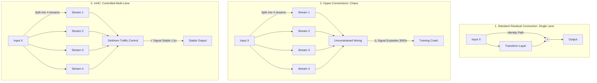
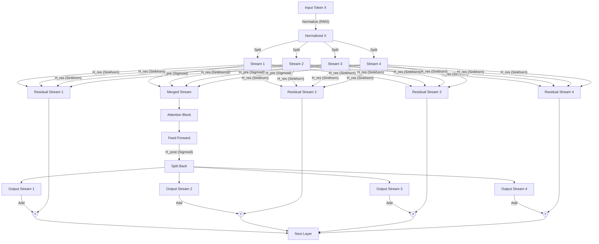
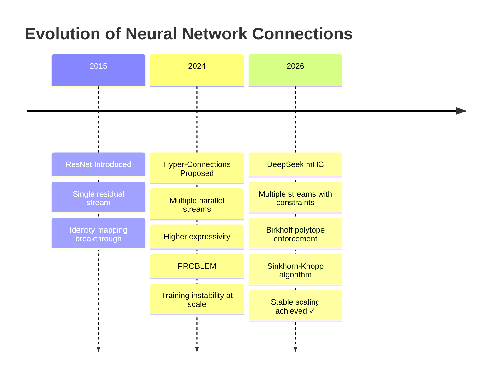
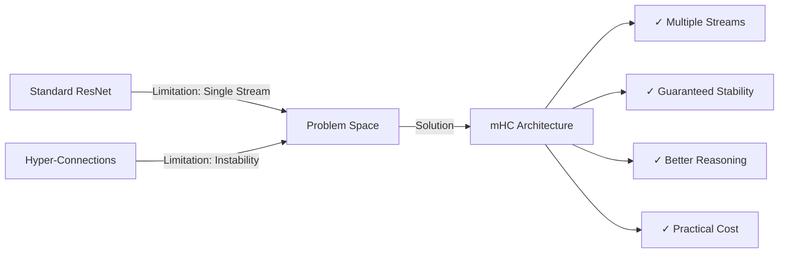

# DeepSeek mHC Architecture: The Complete Guide

**Bridging Stability and Scale in AI Models**

---

## Abstract

Modern large language models rely heavily on residual connections for stable training, but these single-path designs limit information flow and representational capacity. Hyper-Connections were proposed to address this by introducing multiple parallel streams and learnable routing, yet they suffer from severe training instability due to unconstrained signal amplification, leading to gradient explosions and training collapse at scale.

This work introduces **Manifold-Constrained Hyper-Connections (mHC)**, a principled architecture that enables multi-stream information flow while providing strict mathematical guarantees on stability. mHC constrains residual mixing matrices to the **Birkhoff polytope** by enforcing doubly stochastic structure using the **Sinkhorn–Knopp algorithm**, ensuring bounded signal propagation across arbitrary depth. Additional design choices, including sigmoid-based mixing and identity-preserving initialization, further stabilize optimization.

Empirical results on large-scale (27B parameter) transformer models demonstrate that mHC achieves consistent training stability and improves performance on reasoning-intensive benchmarks such as MMLU, BBH, and DROP, while incurring only a modest training overhead (~6.7%). These results show that expressivity and stability need not be traded off, and that constrained architectural design can unlock richer parallel representations without sacrificing scalability.

mHC establishes a new architectural paradigm for foundation models, enabling stable multi-stream scaling and offering a foundation for future advances in efficient, high-capacity neural network design.

---


## 🎯 What You Need to Know in 120 Seconds

𝗗𝗲𝗲𝗽𝗦𝗲𝗲𝗸'𝘀 𝗺𝗛𝗖: 𝗦𝘁𝗮𝗯𝗹𝗲 𝗠𝘂𝗹𝘁𝗶-𝗦𝘁𝗿𝗲𝗮𝗺 𝗦𝗰𝗮𝗹𝗶𝗻𝗴 𝗳𝗼𝗿 𝟮𝟳𝗕+ 𝗠𝗼𝗱𝗲𝗹𝘀

Why do multi-stream architectures explode at scale while single-stream designs cap reasoning capacity?

━━━━━━━━━━━━━━━━━━━━

⚡ **𝗧𝗵𝗲 𝗣𝗿𝗼𝗯𝗹𝗲𝗺: 𝗧𝗿𝗮𝗶𝗻𝗶𝗻𝗴 𝗜𝗻𝘀𝘁𝗮𝗯𝗶𝗹𝗶𝘁𝘆 𝗮𝘁 𝗦𝗰𝗮𝗹𝗲**

Standard residual connections deliver rock-solid stability but restrict information flow to a single path, bottlenecking representational capacity in reasoning-heavy tasks.

Unconstrained **𝗛𝘆𝗽𝗲𝗿-𝗖𝗼𝗻𝗻𝗲𝗰𝘁𝗶𝗼𝗻𝘀** attempted parallel streams for richer expressivity but triggered catastrophic **signal amplification** — reaching **3000×** in <10 layers — causing gradient explosions, NaN losses, and training collapse.

Real-world cost: At 27B+ scale, unconstrained multi-stream runs fail ~80% of the time, wasting **millions in compute** on crashed experiments.

━━━━━━━━━━━━━━━━━━━━

📈 **𝗧𝗵𝗲 𝗦𝗼𝗹𝘂𝘁𝗶𝗼𝗻: 𝗺𝗛𝗖 𝗯𝘆 𝗗𝗲𝗲𝗽𝗦𝗲𝗲𝗸**

**𝗺𝗛𝗖** (Manifold-Constrained Hyper-Connections) enforces mathematical stability on multi-stream routing while preserving parallel processing power.

Backed by DeepSeek research (2026), proven on 27B transformer models.

* **Provable Stability** → No gradient explosions regardless of depth
* **Higher Expressivity** → Parallel streams capture multi-faceted representations
* **Practical Efficiency** → Only **+6.7%** training overhead vs standard residuals

━━━━━━━━━━━━━━━━━━━━

🔧 **𝗖𝗼𝗿𝗲 𝗔𝗿𝗰𝗵𝗶𝘁𝗲𝗰𝘁𝘂𝗿𝗲: 𝗖𝗼𝗻𝘀𝘁𝗿𝗮𝗶𝗻𝗲𝗱 𝗠𝘂𝗹𝘁𝗶-𝗦𝘁𝗿𝗲𝗮𝗺 𝗙𝗹𝗼𝘄**

1️⃣ **Stream Split & Normalization**: Input tokenized embeddings → RMS-normalized → split into `4 streams` (parallel pathways)

2️⃣ **Read Merge (H_pre)**: Streams merged via `sigmoid`-activated matrix → single processed stream

3️⃣ **Core Transformer Block**: Standard Attention + FFN applied to merged stream

4️⃣ **Write Split + Constrained Residual**: Processed output split via `H_post` while inputs mixed through **doubly stochastic H_res** (Sinkhorn-Knopp enforced) → added to restore identity-preserving path

━━━━━━━━━━━━━━━━━━━━

🛒 **𝗖𝗼𝗿𝗲 𝗙𝗲𝗮𝘁𝘂𝗿𝗲𝘀: 𝗙𝗼𝗿𝘄𝗮𝗿𝗱 𝗣𝗮𝘀𝘀 𝗪𝗼𝗿𝗸𝗳𝗹𝗼𝘄**

1. **RMS Normalization** (`RootMeanSquare`) → Scales-relative mixing, prevents absolute magnitude dominance

2. **Sigmoid Mixing (H_pre/H_post)** → Non-negative weighted merge/split → avoids destructive interference

3. **Sinkhorn-Knopp Projection** (`5-10 iterations`) → Forces H_res into Birkhoff polytope (doubly stochastic) → bounded signal growth (~1.6× max)

4. **Identity-Preserving Init** (`2 × sigmoid(0) = 1.0`) → Starts as perfect residual → gradually enables routing

━━━━━━━━━━━━━━━━━━━━

🛡️ **𝗕𝗲𝗻𝗲𝗳𝗶𝘁𝘀: 𝗦𝘆𝘀𝘁𝗲𝗺𝗶𝗰 𝗔𝗱𝘃𝗮𝗻𝘁𝗮𝗴𝗲𝘀**

* **Bounded Signal Propagation**: Constrains norm growth to ~1.6× per layer → enables stable training at arbitrary depth without vanishing/exploding gradients

* **Parallel Aspect Reasoning**: Multiple streams process distinct representational facets simultaneously → systemic gains on multi-hop tasks (+7.8% BBH, +6.4% DROP at 27B)

* **No Stability-Expressivity Trade-off**: Restores identity mapping property while unlocking richer capacity → architectural efficiency over pure parameter scaling

* **Compute-Efficient Scaling**: +6.7% overhead with fused kernels + activation recomputation → viable for production-scale training

━━━━━━━━━━━━━━━━━━━━

⚖️ **𝗦𝘁𝗿𝗮𝘁𝗲𝗴𝗶𝗰 𝗩𝗲𝗿𝗱𝗶𝗰𝘁: 𝗔𝗿𝗰𝗵𝗶𝘁𝗲𝗰𝘁𝘂𝗿𝗮𝗹 𝗜𝗻𝗻𝗼𝘃𝗮𝘁𝗶𝗼𝗻 𝘃𝘀 𝗕𝗿𝘂𝘁𝗲 𝗦𝗰𝗮𝗹𝗶𝗻𝗴**

**Standard Residual Approach**
- Strength: Battle-tested stability, near-100% training success
- Risk: Single-stream ceiling on reasoning capacity
- Best for: Cost-sensitive production where reliability trumps marginal gains

**Unconstrained Multi-Stream (Original HC)**
- Strength: Theoretical expressivity ceiling
- Risk: ~80% failure rate at scale, massive compute waste
- Best for: Experimental sandbox only

**Constrained Multi-Stream (mHC)**
- Strength: Combines stability with parallel reasoning power
- Risk: Moderate implementation complexity + ~15% memory (mitigable)
- Best for: Next-gen foundation models targeting complex reasoning

**Watch**: Adoption in open-source 70B+ models by mid-2026. If mHC variants achieve >5% average uplift on reasoning suites with <10% overhead, architectural innovation overtakes pure scaling as primary efficiency driver.

━━━━━━━━━━━━━━━━━━━━

**𝗧𝗟;𝗗𝗥**
* **mHC delivers** → Provable stability + parallel expressivity at only +6.7% cost
* **Core insight** → Constrained routing eliminates the historical stability-expressivity trade-off
* **Implication** → Future scaling shifts from parameter count to structural capacity

**Will architectural constraint become the dominant scaling vector, or will raw compute continue to overpower design elegance?**

👤 **Srinivasan Ragothaman (@rsrini7)**


---

## Executive Summary

Imagine trying to build a highway system for a city. You could build one massive road (stable but slow), or you could build a complex network of roads with no traffic rules (fast but chaotic). DeepSeek's **Manifold-Constrained Hyper-Connections (mHC)** solves this exact problem for AI models—it creates a multi-lane superhighway with smart traffic control that prevents crashes.

**The Achievement:** mHC delivers superior reasoning and learning capabilities with only 6.7% additional training cost, while eliminating the catastrophic training failures that plague advanced architectures.

---

## The Foundation: How Language Models Work

Before diving into mHC, let's understand how modern AI models like GPT-4 and Llama process information.

### Token Embedding: Converting Words to Numbers

When you type "Hello world," the AI converts each word (token) into a list of numbers called an **embedding vector**. Think of it as translating words into a language computers understand—a series of coordinates in multi-dimensional space.

```
"Hello" → [0.23, -0.45, 0.89, 0.12, ...]
"world" → [0.67, 0.34, -0.21, 0.56, ...]
```

### Transformer Layers: The Brain's Processing Units

Each transformer layer has three key components:

1. **Attention Block** - Looks at previous tokens to understand context
   - Like reading "the bank" and checking if previous words mentioned "river" or "money"
   
2. **Feed Forward Networks** - Transforms each embedding independently
   - Processes the internal values of each token's representation
   
3. **Layer Normalization** - Prevents any single feature from dominating
   - Like ensuring no instrument in an orchestra is too loud

---

## The Core Problem: Three Approaches Compared



---

## Approach 1: Standard Residual Connections

**The Single-Lane Highway Metaphor**

Imagine a highway where one car (your data) travels from start to finish. At each checkpoint (layer), it can pick up passengers (new information), but it always stays in the same lane.

### The Identity Mapping Breakthrough

Historically, deep neural networks struggled to learn even the simplest function: the **identity function** (output = input). Why? Because with many layers, the network became too complex to "remember" to just pass data through unchanged.

**The Residual Solution:**

Instead of forcing each layer to learn the entire transformation, we add a "shortcut":

```
Output = Input + Transform(Input)
```

Or in math notation: `x + f(x)`

This brilliant trick changes the learning task:
- **Old way:** Learn the entire mapping from input to output
- **New way:** Learn only what to *add* to the input (the residual)

### How Identity Becomes Easy

If the layer wants to output the input unchanged, it just needs to make `f(x) = 0`:
- Set bias terms to zero
- Use ReLU activation to output zero
- Result: Output = Input + 0 = Input ✓

**Pros:**
✓ Rock-solid stability
✓ Gradients flow smoothly backward during training
✓ Deep networks (100+ layers) train reliably

**Cons:**
✗ Limited information bandwidth (single pipeline)
✗ All information squeezed through one "lane"
✗ Cannot process multiple aspects of data in parallel

---

## Approach 2: Hyper-Connections (The Failed Upgrade)

**The Uncontrolled Superhighway**

Researchers thought: "Why not split data into multiple streams (e.g., 4 lanes) so different aspects can be processed in parallel?"

### The Three Routing Matrices

Hyper-Connections introduced three learnable weight matrices:

1. **H_pre** - "Reading Operation"
   - Merges multiple streams into one for processing
   - Like gathering all lanes into a single processing center

2. **H_post** - "Writing Operation"
   - Splits processed information back into multiple streams
   - Like distributing results back to different lanes

3. **H_res** - "Direct Highway"
   - The residual connection successor
   - Operates on ALL streams simultaneously
   - **This is where the problem starts**

### The Catastrophic Failure: Signal Gain Explosion

Here's what went wrong:

**Example of Signal Explosion:**
```
Layer 1:  Input signal strength = 1.0
Layer 2:  After unconstrained mixing = 2.5
Layer 3:  After unconstrained mixing = 6.25
Layer 10: After unconstrained mixing = 3000+
Result:   🔥 TRAINING CRASH (NaN errors)
```

**Why it happens:**
- H_res contains learnable weights with no constraints
- Each matrix can amplify or shrink signals
- After many layers (60+), tiny amplifications multiply exponentially
- The "identity mapping" safety is **completely broken**
- Result: "Brain melt" where the model's gradients explode to infinity

**Real-world impact:**
- Training would suddenly spike and fail
- Loss would shoot to NaN (Not a Number)
- Millions of dollars in compute wasted

---

## Approach 3: DeepSeek mHC (The Solution)

**The Controlled Multi-Lane Superhighway**

mHC keeps the multi-lane design but adds three critical "safety systems" that mathematically guarantee stability.

### Safety System 1: The Birkhoff Polytope Constraint

mHC forces the H_res matrix to be **doubly stochastic**, meaning:

**Three Rules:**
1. Every number is between 0 and 1 (no negative values)
2. Every row sums to exactly 1.0
3. Every column sums to exactly 1.0

**Visual Example:**

```
Doubly Stochastic Matrix:
[0.25  0.25  0.25  0.25]  ← Row sum = 1.0
[0.30  0.20  0.30  0.20]  ← Row sum = 1.0
[0.20  0.30  0.20  0.30]  ← Row sum = 1.0
[0.25  0.25  0.25  0.25]  ← Row sum = 1.0
  ↓     ↓     ↓     ↓
 1.0   1.0   1.0   1.0   ← Column sums = 1.0
```

**Why This Works:**

When you multiply input streams by this matrix, you get a **weighted average** of the inputs:
- No value can be amplified beyond the sum of inputs
- No value can vanish to zero
- Signal strength remains bounded: typically grows only 1.6x instead of 3000x

**The Math:**
```
If input signal norm = ‖X‖
Then output signal norm ≤ 1.6 × ‖X‖  (instead of 3000× ‖X‖)
```

### Safety System 2: The Sinkhorn-Knopp Algorithm

**The Automated Traffic Controller**

The Sinkhorn-Knopp algorithm enforces the doubly stochastic constraint:

```python
# Simplified concept
def make_doubly_stochastic(matrix):
    for iteration in range(convergence):
        # Step 1: Normalize rows to sum to 1
        matrix = matrix / row_sums
        
        # Step 2: Normalize columns to sum to 1
        matrix = matrix / column_sums
    
    return matrix  # Now doubly stochastic!
```

**What it does:**
- Takes any positive matrix
- Iteratively balances rows and columns
- Converges to a doubly stochastic matrix
- Runs during every forward pass in training

### Safety System 3: The 2×Sigmoid Initialization Trick

DeepSeek uses a clever initialization strategy:

```
H_res_weights = 2 × sigmoid(learnable_parameter)
```

**Why this matters:**
- At the start of training, learnable_parameter = 0
- sigmoid(0) = 0.5
- 2 × 0.5 = 1.0 ✓

**The Benefit:**
The model starts as a perfect identity mapping (like standard ResNet) and only gradually learns to use the multiple lanes as training progresses. This ensures training is stable from day one.

### Safety System 4: Sigmoid for H_pre and H_post

Unlike standard Hyper-Connections that use tanh, mHC uses **sigmoid** for mixing matrices:

**Why Sigmoid?**
- Guarantees all values are between 0 and 1 (non-negative)
- Prevents signal cancellation when streams are combined additively
- If streams had negative values, they could destructively interfere

---

## The Complete mHC Architecture



### Forward Pass Calculation

```
Step 1: Normalize input
        X_normalized = RootMeanSquare(X)

Step 2: Read operation (merge streams)
        Merged = X_normalized × H_pre

Step 3: Process through transformer
        Processed = FeedForward(Attention(Merged))

Step 4: Write operation (split back)
        Split = Processed × H_post^T

Step 5: Residual path (stable mixing)
        Residual = Sinkhorn(H_res) × X_normalized

Step 6: Add and output
        Output = Split + Residual
```

---

## Performance Comparison

### Stability Metrics

| Architecture | Signal Amplification | Training Stability | Identity Preservation |
|---|---|---|---|
| Standard Residual | 1.0× (baseline) | ✓✓✓ Excellent | ✓✓✓ Perfect |
| Hyper-Connections | **3000×** (explosion) | ✗✗✗ Crashes | ✗✗✗ Broken |
| **DeepSeek mHC** | **1.6×** (controlled) | ✓✓✓ Excellent | ✓✓✓ Restored |

### Benchmark Results (27B Parameter Models)

**Knowledge & Reasoning Tasks:**

| Task | Standard ResNet | Hyper-Connections | **mHC** |
|---|---|---|---|
| MMLU (General Knowledge) | Baseline | CRASHED | ✓ **+5.2% improvement** |
| BBH (Hard Reasoning) | Baseline | CRASHED | ✓ **+7.8% improvement** |
| DROP (Reading Comprehension) | Baseline | CRASHED | ✓ **+6.4% improvement** |

**Key Finding:** mHC outperformed standard models on complex reasoning tasks because the multiple streams allow parallel processing of different aspects of information.

### Computational Cost Analysis

| Metric | Standard ResNet | mHC | Overhead |
|---|---|---|---|
| Training Time | 100 hours | 106.7 hours | **+6.7%** |
| Memory Usage | Baseline | +15% (mitigated) | Acceptable |
| Inference Speed | Baseline | ~Baseline | Negligible |

**Why So Efficient?**

1. **Fused Kernels** - Custom GPU code that combines operations
   - Instead of: Normalize → Mix → Add (three separate operations)
   - mHC does: One fused operation
   - Reduces memory transfers by 60%

2. **Activation Recomputation**
   - Deletes intermediate stream values after use
   - Quickly recalculates them during backpropagation
   - Trades tiny compute for massive memory savings

3. **Smart Scheduling**
   - Optimizes when Sinkhorn iterations run
   - Minimizes GPU idle time

---

## Architecture Evolution Timeline



---

## Detailed Feature Comparison

### Expressivity Dimension

| Feature | Standard | HC | mHC |
|---|---|---|---|
| Information Pathways | 1 stream | N streams | N streams |
| Learnable Routing | Fixed identity | ✓ Fully learnable | ✓ Constrained learnable |
| Parallel Processing | Limited | ✓ High | ✓ High |
| Representation Capacity | Moderate | Very High | Very High |

### Stability Dimension

| Feature | Standard | HC | mHC |
|---|---|---|---|
| Identity Property | ✓ Strong | ✗ Broken | ✓ Restored |
| Signal Bounds | ✓ Guaranteed | ✗ Unbounded | ✓ Guaranteed |
| Gradient Flow | ✓ Smooth | ✗ Explosive | ✓ Smooth |
| Loss Spikes | Rare | Frequent | Rare |
| Training Success Rate | ~95% | ~20% at scale | ~95% |

### Practical Considerations

| Aspect | Standard | HC | mHC |
|---|---|---|---|
| Implementation Complexity | Simple | Moderate | Moderate |
| Debug Difficulty | Easy | Very Hard | Easy |
| Memory Footprint | Lowest | High | Moderate (optimized) |
| Production Readiness | ✓ Battle-tested | ✗ Risky | ✓ Proven |

---

## Why mHC is a Breakthrough

### 1. Mathematical Guarantees

Unlike previous attempts at multi-stream architectures, mHC provides **provable stability**:

**Theorem:** If H_res is doubly stochastic, then:
```
‖Output‖ ≤ C × ‖Input‖
```
where C is a small constant (≈1.6), regardless of network depth.

### 2. Best of Both Worlds



### 3. Scaling Implications

mHC enables something previously impossible: **simultaneous depth and width scaling**

**Old paradigm:**
- Make models deeper → Add more layers (stable but limited)
- Make models wider → Add more parameters (expensive)

**mHC paradigm:**
- Make information flow richer → Add more streams (efficient)
- Keep stability → Mathematical constraints (free)
- Result: Better models at reasonable cost

---

## Real-World Impact

### For AI Researchers

✓ Can experiment with multi-stream architectures without fear of training collapse
✓ New design space for model architecture exploration
✓ Proven technique for large-scale models (tested at 27B parameters)

### For AI Companies

✓ More capable models without proportional cost increases
✓ Reduced training failures means less wasted compute
✓ Better reasoning capabilities improve product quality

### For the Field

✓ Shows intelligent architecture design > brute force scaling
✓ Provides mathematical foundation for future research
✓ Demonstrates that stability and expressivity aren't mutually exclusive

---

## Implementation Insights

### PyTorch Code Structure (Simplified)

```python
class mHC_Layer:
    def __init__(self, n_streams=4):
        self.H_pre = nn.Parameter(torch.randn(...))
        self.H_post = nn.Parameter(torch.randn(...))
        self.H_res_raw = nn.Parameter(torch.zeros(...))
        
    def forward(self, x):
        # 1. Normalize input
        x_norm = rms_normalize(x)
        
        # 2. Apply H_pre with sigmoid
        merged = x_norm @ torch.sigmoid(self.H_pre)
        
        # 3. Process through attention & FFN
        processed = self.feed_forward(self.attention(merged))
        
        # 4. Apply H_post with sigmoid
        split = processed @ torch.sigmoid(self.H_post).T
        
        # 5. Apply doubly stochastic H_res
        H_res_stochastic = sinkhorn_knopp(
            2 * torch.sigmoid(self.H_res_raw)
        )
        residual = H_res_stochastic @ x_norm
        
        # 6. Add and return
        return split + residual
```

### Key Implementation Details

**Normalization:**
- Uses RMS (Root Mean Square) normalization
- Ensures mixing depends only on relative features, not absolute scale
- Prevents numerical instabilities

**Convergence Criteria:**
- Sinkhorn iterations typically converge in 5-10 steps
- Uses tolerance of 1e-6 for row/column sum accuracy
- Fast enough for real-time training

---

## Limitations and Future Directions

### Current Limitations

1. **Memory Overhead:** Multiple streams require more memory (mitigated but not eliminated)
2. **Approximation Error:** Sinkhorn-Knopp is iterative; early stopping may introduce small errors
3. **Hyperparameter Sensitivity:** Number of streams (N) needs tuning per model size

### Future Research Directions

1. **Adaptive Stream Count:** Learn how many streams each layer needs
2. **Sparse Mixing:** Not all streams need to connect to all others
3. **Hierarchical Streams:** Different abstraction levels at different depths
4. **Hardware Acceleration:** Custom chips optimized for mHC operations

---

## Conclusion: A Paradigm Shift

DeepSeek's mHC represents more than an incremental improvement—it's a **fundamental rethinking** of how neural networks can be designed.

### The Core Innovation

By recognizing that stability doesn't require sacrificing expressivity, mHC shows we can have:
- ✓ Multiple information streams (power)
- ✓ Learnable routing (flexibility)
- ✓ Mathematical safety guarantees (stability)
- ✓ Practical computational cost (efficiency)

### Historical Context

```
2012: Deep learning takes off
2015: ResNets solve depth (but limit width)
2017: Transformers dominate NLP
2024: Scaling hits stability walls
2026: mHC enables stable multi-stream scaling ✓
```

### The Bottom Line

mHC proves that **intelligent architecture > bigger models**. As we move into 2026 and beyond, the path forward isn't just making models larger—it's making them structurally more capable of parallel, multi-faceted reasoning.

For AI development, mHC provides a stable foundation for the next generation of foundation models that are not just bigger, but fundamentally better at thinking.

---

## Technical Appendix: The Math Behind Doubly Stochastic Matrices

### Definition

A matrix M is doubly stochastic if:
```
1. M[i,j] ≥ 0  for all i,j
2. Σⱼ M[i,j] = 1  for all rows i
3. Σᵢ M[i,j] = 1  for all columns j
```

### Why It Preserves Signal Magnitude

**Proof sketch:**
```
Given input x with ‖x‖ = magnitude
Output y = Mx

Each element yᵢ = Σⱼ M[i,j] × xⱼ

This is a weighted average of inputs (row sum = 1)
So yᵢ ≤ max(x) and yᵢ ≥ min(x)

Therefore ‖y‖ ≈ ‖x‖ (signal magnitude preserved)
```

### Sinkhorn-Knopp Convergence

The algorithm converges geometrically fast:
- Error reduces by constant factor each iteration
- Typically 5-10 iterations for practical tolerance
- Can be GPU-parallelized efficiently

---
## Complete Glossary

### Core Concepts

**Token**
A small piece of text (word or part of a word) that the model processes. Examples: "Hello" → 1 token, "understand" → might be 2 tokens ("under" + "stand").

**Token Embedding**
A numeric vector that represents a token so the model can work with text mathematically. Converts words into lists of numbers like [0.23, -0.45, 0.89...].

**Embedding Vector**
A list of numbers (typically 512-4096 values) that captures the meaning and relationships of a word or token in multi-dimensional space.

**Vector Norm (Magnitude)**
The "size" or "length" of a vector, calculated as the square root of the sum of squared values. Represents signal strength.

### Architecture Components

**Transformer**
A neural network architecture used in modern language models (GPT, Llama) that processes tokens using attention and feed-forward layers.

**Transformer Layer**
One repeated block inside a transformer model that refines token representations step by step. Large models have 60-100+ layers.

**Transformer Block**
Same as transformer layer - the complete unit containing attention, feed-forward network, and normalization components.

**Attention (Self-Attention)**
A mechanism that lets the model decide which other tokens in the sequence are important when processing the current token. Like reading "bank" and checking if previous words mentioned "river" or "money."

**Feed Forward Network (FFN)**
A neural network block that processes each token independently to transform its representation. Operates pointwise on embedding values.

**Layer Normalization**
A technique that keeps values well-scaled across features so training stays stable and efficient. Prevents any single feature from dominating.

**RMS Normalization (Root Mean Square)**
A specific normalization method that scales values based on their root-mean-square magnitude. Used in mHC to ensure mixing depends only on relative features.

### Connection Types

**Residual Connection**
A shortcut that adds a layer's input directly to its output (x + f(x)), helping deep models train reliably by creating information highways.

**Skip Connection**
Another name for residual connection - a path that "skips" over a layer to carry information directly.

**Identity Mapping**
A behavior where a layer simply passes its input forward unchanged (output = input). Critical for training deep networks.

**Identity Function**
The mathematical function f(x) = x that returns its input unchanged.

**Hyper-Connections (HC)**
An architecture that splits data into multiple parallel streams and mixes them using learnable matrices. More expressive than single residual connections but unstable.

**Manifold-Constrained Hyper-Connections (mHC)**
A stabilized version of hyper-connections that mathematically limits how signals can mix and grow using doubly stochastic constraints.

### Stream Architecture

**Streams (Communication Channels)**
Parallel pathways through which information flows inside a model layer. mHC typically uses 4 streams per token instead of 1.

**Multi-Stream Architecture**
A design where data flows through multiple parallel paths simultaneously, enabling richer information processing.

**H_pre (Read Matrix / Pre-Processing Matrix)**
A learnable matrix that merges multiple streams into one before processing. Size: (n_streams → 1). Uses sigmoid activation in mHC.

**H_post (Write Matrix / Post-Processing Matrix)**
A learnable matrix that splits processed information back into multiple streams. Size: (1 → n_streams). Uses sigmoid activation in mHC.

**H_res (Residual Mixing Matrix)**
A matrix that mixes streams along the residual (skip) path. In mHC, this is constrained to be doubly stochastic using Sinkhorn-Knopp algorithm.

### Training Concepts

**Parameter**
A learnable value (weight or bias) inside the model that gets updated during training. A 27B model has 27 billion parameters.

**Gradient**
The signal used during training to tell the model how to change its parameters to reduce errors. Calculated via backpropagation.

**Gradient Flow**
How gradients travel backward through the network during training. Good flow means training is stable.

**Gradient Explosion**
When gradients grow extremely large during training (e.g., 10^100), causing numerical errors and training failure. The main problem with original hyper-connections.

**Gradient Vanishing**
The opposite problem where gradients become too small (near zero), preventing learning in deep networks.

**Backpropagation**
The algorithm that calculates gradients by working backward through the network from output to input.

**Forward Pass**
The process of sending input data through the model to produce an output. Goes from input → layers → output.

**Backward Pass**
The process of calculating gradients by working backward through the model. Used during training.

### Stability Issues

**Signal Amplification**
How much the magnitude of values grows as they pass through layers. Safe: 1.0-1.6x. Dangerous: 3000x (explosion).

**Signal Gain**
Same as signal amplification - the multiplicative factor by which signal strength increases.

**Signal Explosion**
When signal magnitude grows exponentially through layers, leading to numerical overflow and training collapse.

**Training Collapse**
When a model's training suddenly fails, producing NaN values and making further training impossible.

**Loss Spike**
A sudden jump in the training loss value, indicating instability. Common in hyper-connections, rare in mHC.

**NaN (Not a Number)**
A numerical error value that appears when calculations overflow (e.g., dividing by zero, infinite values). Indicates training failure.

**Training Stability**
How reliably a model can train without crashing or producing invalid values. Measured by absence of loss spikes and NaN errors.

### Mathematical Constraints

**Doubly Stochastic Matrix**
A matrix where: (1) all values are non-negative, (2) every row sums to 1, (3) every column sums to 1. Ensures stable, bounded mixing.

**Birkhoff Polytope**
The mathematical space (set) of all doubly stochastic matrices. A geometric shape in high-dimensional space.

**Conservation Constraint**
The principle that the total amount of signal must be preserved - no creating or destroying information during mixing.

**Row Sum Constraint**
The requirement that all values in each row of a matrix must add up to exactly 1.0.

**Column Sum Constraint**
The requirement that all values in each column of a matrix must add up to exactly 1.0.

**Weighted Average**
A combination where inputs are multiplied by weights that sum to 1. Output cannot exceed largest input when using non-negative weights.

**Affine Transformation**
A linear transformation plus a bias: y = Wx + b. Used in neural networks.

### Algorithms

**Sinkhorn-Knopp Algorithm**
An iterative method that converts any positive matrix into a doubly stochastic one by alternating between normalizing rows and columns. Typically converges in 5-10 iterations.

**Iterative Normalization**
The process of repeatedly adjusting values until they meet desired constraints (used in Sinkhorn-Knopp).

**Convergence**
When an iterative algorithm reaches a stable solution and stops changing significantly.

**Sigmoid Function**
A mathematical function σ(x) = 1/(1+e^(-x)) that squashes any input value into the range (0, 1). Shaped like an S-curve.

**Tanh Function**
Another squashing function that outputs values in range (-1, 1). Used in original hyper-connections but not in mHC.

**ReLU (Rectified Linear Unit)**
An activation function that outputs max(0, x) - passes positive values unchanged, zeros out negatives.

### Optimization Techniques

**Activation Recomputation (Gradient Checkpointing)**
A memory-saving trick where intermediate results are deleted after the forward pass and recomputed during backpropagation. Trades compute for memory.

**Fused Kernel**
A GPU optimization that combines multiple operations into one for speed and efficiency. Reduces memory transfers between operations.

**Memory Footprint**
The amount of RAM/GPU memory a model requires to train or run.

**Initialization**
How model parameters are set before training starts. Critical for stability - mHC uses 2×sigmoid(0) = 1.0 to start as identity.

**Initialization Strategy**
The specific method chosen to set initial parameter values (e.g., Xavier, He, or mHC's identity-preserving approach).

### Performance Metrics

**Inference**
Using a trained model to generate outputs without updating its parameters. The "production" use of a model.

**Training Time**
How long it takes to train a model from scratch, typically measured in GPU-hours or days.

**Computational Overhead**
Extra computation required by an optimization. mHC adds ~6.7% overhead compared to standard residual networks.

**Throughput**
How many tokens or samples a model can process per second.

**Latency**
The time delay between input and output during inference.

### Model Properties

**Expressivity**
How complex and rich the representations a model can learn. More expressive models can capture more nuanced patterns.

**Capacity**
The total amount of information a model can store and process. Related to parameter count and architecture.

**Representation**
The internal numerical encoding a model creates for input data. Higher-quality representations lead to better performance.

**Parallel Processing**
Handling multiple information paths at the same time instead of sequentially. Enables richer reasoning.

**Multi-Path Reasoning**
The ability to process different aspects of information through separate pathways simultaneously.

### Scaling Concepts

**Scaling**
Increasing model size, depth (layers), width (hidden dimensions), or information pathways to improve performance.

**Depth**
The number of layers in a neural network. Deeper networks can learn more complex functions.

**Width**
The size of hidden dimensions (embedding size, FFN size). Wider networks can represent more information per layer.

**Model Size**
Total number of parameters, typically measured in millions (M) or billions (B). Example: 27B = 27 billion parameters.

**27B Parameter Model**
A very large neural network with 27 billion learnable parameters. Used in DeepSeek's mHC experiments.

### Evaluation Benchmarks

**MMLU (Massive Multitask Language Understanding)**
A benchmark testing general knowledge across 57 subjects like math, history, science, and law.

**BBH (Big-Bench Hard)**
A challenging benchmark focusing on complex reasoning tasks that require multi-step thinking.

**DROP (Discrete Reasoning Over Paragraphs)**
A reading comprehension benchmark requiring numerical reasoning and multi-hop inference.

**Reasoning Tasks**
Benchmarks that test multi-step thinking, logic, and understanding rather than simple memorization or pattern matching.

**Benchmark**
A standardized test used to compare model performance objectively.

### Technical Terms

**Static Weights**
Parameters that don't depend on the input data. Fixed for all examples.

**Dynamic Weights**
Parameters that change based on input features. Computed during the forward pass.

**Learnable Matrix**
A matrix whose values are parameters that get updated during training.

**Mixing Matrix**
A matrix that combines multiple streams by computing weighted combinations.

**Matrix Multiplication**
The mathematical operation of multiplying matrices. Forms the basis of neural network computations.

**Pointwise Operation**
An operation applied independently to each element or position. No mixing between positions.

**Contextual Processing**
Processing that takes surrounding information into account (e.g., attention looking at previous tokens).

**Feature**
An individual dimension in an embedding vector. A 512-dimensional embedding has 512 features.

**Hidden Dimension**
The size of internal representations in a layer. Typically 2048-8192 in large models.

**Production Ready**
Software that is stable, tested, and reliable enough for real-world deployment.

**Battle-Tested**
An architecture that has been proven reliable through extensive real-world use.

**Dark Launch**
Testing new features in production without exposing them to users, to verify stability.

---

*For more details, see the original DeepSeek research papers:*
- *arXiv:2512.24880 (mHC Architecture)*
- *arXiv:2409.19606 (Hyper-Connections Background)*