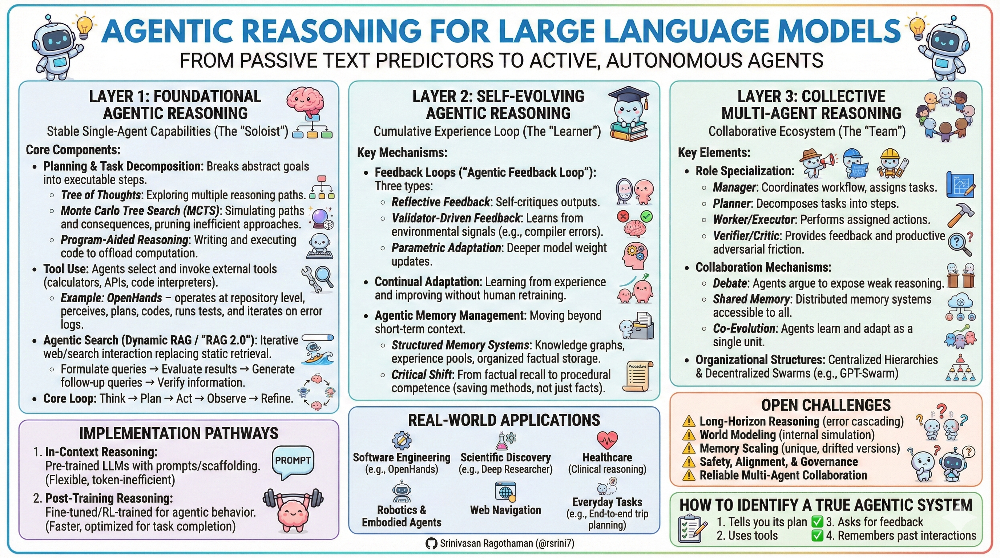
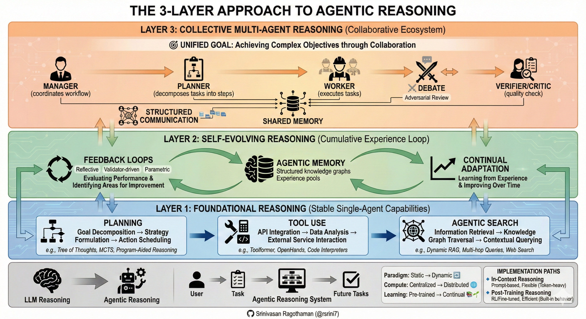
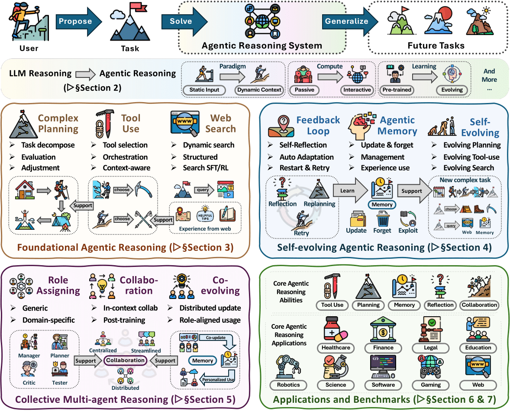
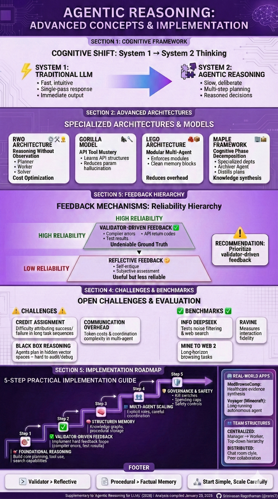

# Comprehensive Consolidated Document: Agentic Reasoning for Large Language Models



---

---

## Executive Summary

This paper represents a paradigm shift in artificial intelligence, transforming Large Language Models (LLMs) from passive, static text predictors into active, autonomous agents capable of planning, acting, learning from experience, and collaborating to achieve complex, real-world goals.

**Core Transformation**: From AI as "thinkers" to AI as "doers" — from line cooks following recipes to chefs who adapt, plan, and create.

**Three progressive layers**
- Foundational (single-agent planning/tool/search)
- Self-Evolving (reflection, memory, adaptation)
- Collective (multi-agent collaboration, roles, debate, swarms).

---

## The Three-Layer Hierarchical Framework

The paper organizes agentic reasoning into three progressive layers, each building upon the previous:

### **LAYER 1: FOUNDATIONAL AGENTIC REASONING**
**Subtitle**: Stable Single-Agent Capabilities (The "Soloist")

This foundational layer enables a single LLM to operate as an autonomous agent rather than a one-shot responder.

#### Core Components:

**1. Planning & Task Decomposition**
- Breaking abstract goals into executable steps
- Advanced planning algorithms:
  - **Tree of Thoughts**: Exploring multiple reasoning paths
  - **Monte Carlo Tree Search (MCTS)**: Simulating different paths and consequences before acting, pruning inefficient approaches
  - **Program-Aided Reasoning**: Writing and executing code to offload computation and reduce hallucination
- Goal decomposition → Strategy formulation → Action scheduling

**2. Tool Use**
- Agents select and invoke external tools (calculators, APIs, code interpreters, repository-level tools)
- Two learning paradigms:
  - **In-Context Learning**: Explicit instructions in prompts (flexible but token-heavy)
  - **Post-Training Learning**: Reinforcement learning or fine-tuning for "muscle memory" (e.g., Toolformer-style)
- Capabilities include:
  - API Integration
  - Data Analysis
  - External Service Interaction
- Advanced example: **OpenHands** — operates at repository level, can perceive, plan, code, run tests, and iterate based on error logs

**3. Agentic Search (Dynamic RAG / "RAG 2.0")**
- Iterative web/search interaction replacing static retrieval
- Process: Formulate queries → Evaluate results → Generate follow-up queries → Verify information
- "Surfing the web" to gather comprehensive information
- Enables multi-hop reasoning and real-time information gathering
- Components:
  - Information Retrieval
  - Knowledge Graph Traversal
  - Contextual Querying

**Core Loop**: Think → Plan → Act (use tools/search) → Observe → Refine

---

### **LAYER 2: SELF-EVOLVING AGENTIC REASONING**
**Subtitle**: Cumulative Experience Loop (The "Learner")

This layer enables agents to improve over time without human retraining, turning experience into expertise.

#### Key Mechanisms:

**1. Feedback Loops ("Agentic Feedback Loop")**

Three types of feedback:
- **Reflective Feedback**: Agent self-critiques its own outputs and iterations
- **Validator-Driven Feedback**: Learns from environmental signals (e.g., compiler errors, test failures), continuously looping until tests pass
- **Parametric Adaptation**: Rare but deeper — updating model weights based on outcomes, fundamentally changing the AI's "brain"

**2. Continual Adaptation**
- Learning from experience and improving over time
- Dynamic learning without human retraining
- Building expertise through accumulated experience

**3. Agentic Memory Management**
- Moving beyond short-term context windows
- **Structured Memory Systems**:
  - Knowledge graphs
  - Experience pools
  - Organized factual storage
- **"Update and Forget" Strategy**: Managing context window clutter
- **Critical Shift**: From factual recall to procedural competence
  - Storing successful problem-solving traces
  - Building a library of reusable solutions
  - Saving methods and logic, not just facts

**Outcome**: Agents accumulate expertise, adapt strategies, and achieve continual self-improvement through reflection and memory.

---

### **LAYER 3: COLLECTIVE MULTI-AGENT REASONING**
**Subtitle**: Collaborative Ecosystem (The "Team")

This layer scales intelligence by orchestrating multiple specialized agents working toward a unified goal.

#### Key Elements:

**1. Role Specialization**

Common specialized roles:
- **Manager**: Coordinates overall workflow, assigns tasks, breaks down large goals
- **Planner**: Decomposes tasks into smaller, achievable steps
- **Worker/Executor**: Performs assigned actions
- **Verifier/Critic**: Provides feedback, requests revisions, introduces productive adversarial friction to improve quality

**2. Collaboration Mechanisms**

- **Debate**: Agents argue to expose weak reasoning and improve accuracy (research shows significant accuracy increases)
- **Structured Communication**: Passing outputs (e.g., code, plans) as inputs to others in chain-of-thought progression
- **Shared Memory**: Distributed memory systems accessible to all agents
- **Co-Evolution**: Agents learn and adapt as a single unit

**3. Organizational Structures**

- **Centralized Hierarchies**: Top-down coordination with clear manager roles
- **Decentralized Swarms**: Self-organizing systems (e.g., GPT-Swarm) that adapt structure based on the problem

**Benefit**: Emergent intelligence that surpasses single-agent capabilities on complex, long-horizon tasks.

---

## Implementation Pathways

The paper contrasts two fundamental approaches to building agentic systems:

### **1. In-Context Reasoning**
**Approach**: Uses pre-trained LLMs with sophisticated prompts and external scaffolding (Python code, loops)

**Advantages**:
- Flexible and adaptable
- No additional training required
- Cost-effective for development

**Drawbacks**:
- Token-inefficient
- Requires re-explaining workflows each iteration
- High operational costs

### **2. Post-Training Reasoning**
**Approach**: Fine-tunes or RL-trains models to natively exhibit agentic behavior

**Advantages**:
- Faster inference
- Smaller, more efficient models
- Baked-in planning/tool-use instincts
- Models "natively know how to act as agents"
- Optimized for task completion

**Status**: Considered the "real frontier" for scalable, efficient agents

---

## Real-World Applications

The framework demonstrates broad applicability across multiple domains:

### **1. Software Engineering & Agentic Coding**
- Full repository management
- Dependency handling
- Iterative testing and debugging
- **Example**: OpenHands (repository-level operations)
- Contrasted with "vibe coding" — emphasizes automated, rigorous development

### **2. Scientific Discovery & Research**
- Hypothesis generation and testing
- Literature review and synthesis
- Lab equipment control
- **Examples**: 
  - **Paper QA**: Prioritizes factual grounding and citations
  - **Deep Researcher**: Browses live web, gathers data, actively corroborates information
- Described as a "killer app" for science

### **3. Healthcare**
- Clinical reasoning
- Explainable diagnostics
- Evidence-based recommendations

### **4. Robotics & Embodied Agents**
- Physical world interaction
- Sensor integration
- Real-time adaptation

### **5. Web Navigation & Information Synthesis**
- Dynamic information gathering
- Multi-source verification
- Complex query resolution

### **6. Everyday Tasks**
**Illustrative Example**: End-to-end trip planning
- Search for flights
- Check weather forecasts
- Make reservations
- Request user feedback
- Book everything
- Provide complete itinerary

---

## The Paradigm Shifts

### **1. From Static to Dynamic**
- Old: Passive static input processing
- New: Interactive dynamic contexts

### **2. From Single-Pass to Multi-Step**
- Old: Single-pass inference
- New: Multi-step reasoning with feedback incorporation

### **3. From Centralized to Distributed**
- Old: Single model handles everything
- New: Specialized agents collaborate

### **4. From Pre-Trained to Continual**
- Old: Fixed knowledge from training
- New: Continual self-improvement and learning

### **5. From Compute to Learning**
- Old: Optimize individual answers
- New: Optimize the reasoning process itself

---

## Open Challenges & Future Research

The paper explicitly identifies major remaining hurdles:

### **1. Long-Horizon Reasoning and Planning**
- Major barrier to true autonomy
- Error cascading: Small errors compound over long tasks
- Agents getting stuck in loops or "rabbit holes"
- Need for robust error recovery mechanisms

### **2. World Modeling**
- Need for internal simulation of environment
- Predicting consequences of actions before execution
- Building accurate mental models of complex systems

### **3. Memory Scaling and Personalization**
- Creating unique, "non-fungible" agents with individualized experience
- Agents curate their own memories and procedural skills
- Leading to unique, drifted versions of models over time
- Managing long-term memory effectively

### **4. Safety, Alignment, and Governance**
- Ensuring autonomous systems remain safe
- Alignment in collaborative, multi-agent settings
- Governance frameworks for responsible deployment
- Preventing harmful autonomous behaviors

### **5. Reliable Multi-Agent Collaboration**
- Avoiding instability in multi-agent systems
- Ensuring productive rather than destructive interaction
- Conflict resolution mechanisms

---

## How to Identify a True Agentic System

You're interacting with a genuine agentic system if it:

1. **Tells you its plan** — Explicit about its reasoning strategy
2. **Uses tools** — Actively invokes external resources
3. **Asks for feedback** — Seeks your input to refine approach
4. **Remembers past interactions** — Builds on previous experience

---

## Key Takeaways

### **Main Transformation**
Agentic reasoning marks a fundamental evolution: from LLMs as passive "thinkers" or "line cooks" that follow fixed recipes, to active "doers" or "chefs" that observe, plan, adapt, improvise, and collaborate.

### **Future Direction**
The future of AI shifts from optimizing single answers to optimizing the reasoning process itself, enabling systems that act as true partners rather than tools.

### **Philosophical Shift**
- From knowledge to action
- From tools to partners
- From static prediction to active autonomous agency

---

## Technical Architecture Summary

```
User Input → Task Definition
    ↓
[LAYER 1: Foundational Reasoning]
    → Planning (decompose goals)
    → Tool Use (execute actions)
    → Agentic Search (gather info)
    ↓
[LAYER 2: Self-Evolving Reasoning]
    → Agentic Memory (store experience)
    → Feedback Loops (self-critique)
    → Continual Adaptation (improve)
    ↓
[LAYER 3: Collective Reasoning]
    → Manager (coordinate)
    → Workers (execute)
    → Verifier (quality check)
    → Shared Memory (collaborate)
    ↓
Unified Goal Achievement → Future Tasks
```

---

## Conclusion

This paper presents a comprehensive roadmap for transforming Large Language Models from sophisticated text generators into autonomous reasoning agents capable of planning, learning, and collaborating. The three-layer framework—Foundational, Self-Evolving, and Collective—provides a structured approach to building increasingly sophisticated AI systems.

While significant challenges remain in areas like long-horizon reasoning, world modeling, and safe governance, the paper establishes a clear vision for the future of AI: systems that don't just think, but act, learn, and partner with humans to achieve complex real-world objectives.

The shift from passive prediction to active autonomous agency represents one of the most significant evolutions in AI development, with implications spanning scientific discovery, healthcare, software engineering, and beyond.

---

## Systems & Tools Referenced in the Paper

### **Agentic Coding Systems:**
- **OpenHands** - Repository-level agentic coding system with perception, planning, testing, and iteration capabilities

### **Scientific Research Systems:**
- **Paper QA** - Research agent prioritizing factual grounding and citations
- **Deep Researcher** - Web-browsing research agent with active information corroboration

### **Foundational Techniques:**
- **Toolformer** - Post-training tool use learning system (muscle memory approach)
- **Tree of Thoughts** - Advanced planning algorithm for exploring multiple reasoning paths
- **Monte Carlo Tree Search (MCTS)** - Simulation-based planning for consequence prediction
- **GPT-Swarm** - Decentralized multi-agent self-organizing system

### **Methodologies:**
- **Dynamic RAG (RAG 2.0)** - Iterative information retrieval approach
- **Program-Aided Reasoning** - Code generation for computation offloading

---



---

## References

### **Main Paper: "Agentic Reasoning for Large Language Models"**
- **ArXiv**: https://arxiv.org/abs/2601.12538
- **ArXiv PDF**: https://arxiv.org/pdf/2601.12538
- **HuggingFace**: https://huggingface.co/papers/2601.12538
- **GitHub Repository (Awesome List)**: https://github.com/weitianxin/Awesome-Agentic-Reasoning
- **Publication Date**: January 18, 2026
- **Authors**: Tianxin Wei and 28 other authors
- **Analysis Scope**: ~800 papers reviewed

---


Ref: https://www.youtube.com/watch?v=GZha5ccTiQM

**Related:**
- [Prompt-Repetition-RE2](Prompt-Repetition-RE2.md) — RE2 prompt repetition complements agentic planning by improving long-context factual grounding.
