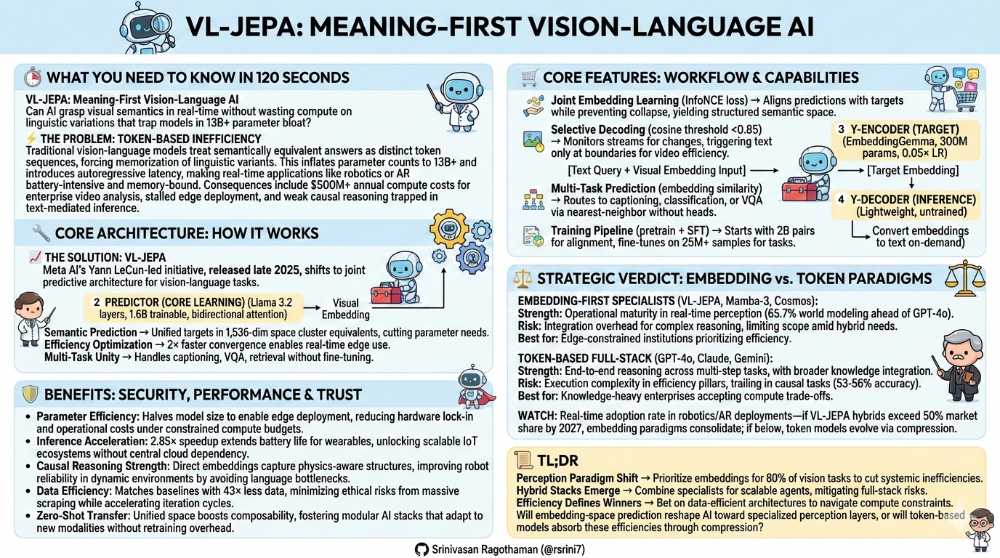

# VL-JEPA: Executive Brief

## 🎯 What You Need to Know in 120 Seconds

𝗩𝗟-𝗝𝗘𝗣𝗔: 𝗠𝗲𝗮𝗻𝗶𝗻𝗴-𝗙𝗶𝗿𝘀𝘁 𝗩𝗶𝘀𝗶𝗼𝗻-𝗟𝗮𝗻𝗴𝘂𝗮𝗴𝗲 𝗔𝗜
Can AI grasp visual semantics in real-time without wasting compute on linguistic variations that trap models in **13B+ parameter bloat**?

━━━━━━━━━━━━━━━━━━━━

⚡ **𝗧𝗵𝗲 𝗣𝗿𝗼𝗯𝗹𝗲𝗺: 𝗧𝗼𝗸𝗲𝗻-𝗕𝗮𝘀𝗲𝗱 𝗜𝗻𝗲𝗳𝗳𝗶𝗰𝗶𝗲𝗻𝗰𝘆**
Traditional vision-language models treat semantically equivalent answers as distinct token sequences, forcing memorization of linguistic variants. This inflates parameter counts to **13B+** and introduces autoregressive latency, making real-time applications like robotics or AR battery-intensive and memory-bound. Consequences include **$500M+ annual compute costs** for enterprise video analysis, stalled edge deployment, and weak causal reasoning trapped in text-mediated inference.

━━━━━━━━━━━━━━━━━━━━

📈 **𝗧𝗵𝗲 𝗦𝗼𝗹𝘂𝘁𝗶𝗼𝗻: 𝗩𝗟-𝗝𝗘𝗣𝗔**
Meta AI's Yann LeCun-led initiative, released late 2025, shifts to joint embedding predictive architecture for vision-language tasks.
* **Semantic Prediction** → Unified targets in 1,536-dim space cluster equivalents, cutting parameter needs.
* **Efficiency Optimization** → 2× faster convergence enables real-time edge use.
* **Multi-Task Unity** → Handles captioning, VQA, retrieval without fine-tuning.

━━━━━━━━━━━━━━━━━━━━

🔧 **𝗖𝗼𝗿𝗲 𝗔𝗿𝗰𝗵𝗶𝘁𝗲𝗰𝘁𝘂𝗿𝗲: 𝗛𝗼𝘄 𝗜𝘁 𝗪𝗼𝗿𝗸𝘀**
1️⃣ **𝗫-𝗘𝗻𝗰𝗼𝗱𝗲𝗿 (𝗩𝗶𝘀𝗶𝗼𝗻)**: V-JEPA ViT-L converts pixels to spatiotemporal embeddings (`304M` frozen params, video input at `16 frames`).
2️⃣ **𝗣𝗿𝗲𝗱𝗶𝗰𝘁𝗼𝗿 (𝗖𝗼𝗿𝗲 𝗟𝗲𝗮𝗿𝗻𝗶𝗻𝗴)**: Llama 3.2 layers map vision + query to predicted embedding (`1.6B` trainable, bidirectional attention).
3️⃣ **𝗬-𝗘𝗻𝗰𝗼𝗱𝗲𝗿 (𝗧𝗮𝗿𝗴𝗲𝘁)**: EmbeddingGemma defines semantic targets (`300M` params, `0.05×` LR to stabilize).
4️⃣ **𝗬-𝗗𝗲𝗰𝗼𝗱𝗲𝗿 (𝗜𝗻𝗳𝗲𝗿𝗲𝗻𝗰𝗲)**: Converts embeddings to text on-demand (lightweight, untrained).

━━━━━━━━━━━━━━━━━━━━

🛒 **𝗖𝗼𝗿𝗲 𝗙𝗲𝗮𝘁𝘂𝗿𝗲𝘀: 𝗪𝗼𝗿𝗸𝗳𝗹𝗼𝘄 & 𝗖𝗮𝗽𝗮𝗯𝗶𝗹𝗶𝘁𝗶𝗲𝘀**
Embedding-space operations enable unified handling across tasks.
* **Joint Embedding Learning** (`InfoNCE loss`) → Aligns predictions with targets while preventing collapse, yielding structured semantic space.
* **Selective Decoding** (`cosine threshold <0.85`) → Monitors streams for changes, triggering text only at boundaries for video efficiency.
* **Multi-Task Prediction** (`embedding similarity`) → Routes to captioning, classification, or VQA via nearest-neighbor without heads.
* **Training Pipeline** (`pretrain + SFT`) → Starts with 2B pairs for alignment, fine-tunes on 25M+ samples for tasks.

━━━━━━━━━━━━━━━━━━━━

🛡️ **𝗕𝗲𝗻𝗲𝗳𝗶𝘁𝘀: 𝗦𝗲𝗰𝘂𝗿𝗶𝘁𝘆, 𝗣𝗲𝗿𝗳𝗼𝗿𝗺𝗮𝗻𝗰𝗲 & 𝗧𝗿𝘂𝘀𝘁**
* **Parameter Efficiency**: Halves model size to enable edge deployment, reducing hardware lock-in and operational costs under constrained compute budgets.
* **Inference Acceleration**: 2.85× speedup extends battery life for wearables, unlocking scalable IoT ecosystems without central cloud dependency.
* **Causal Reasoning Strength**: Direct embeddings capture physics-aware structures, improving robot reliability in dynamic environments by avoiding language bottlenecks.
* **Data Efficiency**: Matches baselines with 43× less data, minimizing ethical risks from massive scraping while accelerating iteration cycles.
* **Zero-Shot Transfer**: Unified space boosts composability, fostering modular AI stacks that adapt to new modalities without retraining overhead.

━━━━━━━━━━━━━━━━━━━━

⚖️ **𝗦𝘁𝗿𝗮𝘁𝗲𝗴𝗶𝗰 𝗩𝗲𝗿𝗱𝗶𝗰𝘁: 𝗘𝗺𝗯𝗲𝗱𝗱𝗶𝗻𝗴 𝘃𝘀. 𝗧𝗼𝗸𝗲𝗻 𝗣𝗮𝗿𝗮𝗱𝗶𝗴𝗺𝘀**
Market fragments between perception specialists and full-stack reasoners, with VL-JEPA's embedding approach challenging token dominance.

**𝗘𝗺𝗯𝗲𝗱𝗱𝗶𝗻𝗴-𝗙𝗶𝗿𝘀𝘁 𝗦𝗽𝗲𝗰𝗶𝗮𝗹𝗶𝘀𝘁𝘀 (𝗩𝗟-𝗝𝗘𝗣𝗔, 𝗠𝗮𝗺𝗯𝗮-𝟯, 𝗖𝗼𝘀𝗺𝗼𝘀)**
- Strength: Operational maturity in real-time perception (`65.7%` world modeling ahead of GPT-4o).
- Risk: Integration overhead for complex reasoning, limiting scope amid hybrid needs.
- Best for: Edge-constrained institutions prioritizing efficiency.

**𝗧𝗼𝗸𝗲𝗻-𝗕𝗮𝘀𝗲𝗱 𝗙𝘂𝗹𝗹-𝗦𝘁𝗮𝗰𝗸 (𝗚𝗣𝗧-𝟰𝗼, 𝗖𝗹𝗮𝘂𝗱𝗲, 𝗚𝗲𝗺𝗶𝗻𝗶)**
- Strength: End-to-end reasoning across multi-step tasks, with broader knowledge integration.
- Risk: Execution complexity in efficiency pillars, trailing in causal tasks (`53-56%` accuracy).
- Best for: Knowledge-heavy enterprises accepting compute trade-offs.

**Watch**: Real-time adoption rate in robotics/AR deployments—if VL-JEPA hybrids exceed `50%` market share by 2027, embedding paradigms consolidate; if below, token models evolve via compression.

━━━━━━━━━━━━━━━━━━━━

**𝗧𝗟;𝗗𝗥**
* **Perception Paradigm Shift** → Prioritize embeddings for 80% of vision tasks to cut systemic inefficiencies.
* **Hybrid Stacks Emerge** → Combine specialists for scalable agents, mitigating full-stack risks.
* **Efficiency Defines Winners** → Bet on data-efficient architectures to navigate compute constraints.

**Will embedding-space prediction reshape AI toward specialized perception layers, or will token-based models absorb these efficiencies through compression?**

👤 **Srinivasan Ragothaman (@rsrini7)**



**Detailed Docs**: 

- [Joint Embedding Predictive Architectures (JEPA) for Vision, Video, and Vision–Language.pdf](../VL-JEPA/JEPA-for-Vision%2C-Video%2C-and-Vision%E2%80%93Language.pdf)
- [JEPA-Models-VL-JEPA-I-JEPA-V-JEPA-Nvidia-Cosmos.pdf](../VL-JEPA/JEPA-Models-VL-JEPA-I-JEPA-V-JEPA-Nvidia-Cosmos.pdf)
- [VL-JEPA.html](../VL-JEPA/VL-JEPA.html)
- [VL-JEPA-Comprehensive-Technical-Guide.md](../VL-JEPA/VL-JEPA-Comprehensive-Technical-Guide.md)
- [LLM-VLA-VLM-VL-JEPA-MAMBA3-DIFFUSION](../comparisons/LLM-VLA-VLM-VL-JEPA-MAMBA3-DIFFUSION.md)

## WHAT IS VL-JEPA?

VL-JEPA (Vision-Language Joint Embedding Predictive Architecture) is a new artificial intelligence model from Meta's research team, led by Yann LeCun. It represents a fundamental rethinking of how AI should process images, videos, and text.

**The Core Insight**: Instead of generating text word-by-word (like ChatGPT), VL-JEPA directly predicts the *meaning* of the answer. This single architectural change delivers major practical and theoretical benefits.

---

## THE PROBLEM IT SOLVES

### Why Current Approaches Waste Effort

When you ask an AI model "What's happening?" while showing a kettle boiling, there are many valid answers:
- "The water is boiling"
- "The kettle is whistling"
- "Steam is rising"
- "The liquid is heating"

**The Traditional Approach**: Current AI models treat these as four completely different answers because they're different sequences of words. The model must memorize all variations, wasting computational effort on linguistic differences that don't change the meaning.

**The Consequences**:
- **Slower Training**: Models need huge parameter counts (13B+) to handle all linguistic variation
- **Slower Inference**: Must generate text one word at a time (autoregressive), introducing latency unacceptable for real-time applications
- **Higher Cost**: Requires expensive language generation modules

### VL-JEPA's Solution

Predict the *meaning* directly in a mathematical "meaning space" where all four answers above naturally cluster together. The model learns one unified target instead of four separate ones.

---

## KEY CONTRIBUTIONS

### 1. **Architectural Innovation**: Non-Generative Vision-Language Model
- First practical vision-language model that achieves real-time performance without autoregressive token generation
- Four-component design: Vision encoder → Predictor (core learning) → Text encoder → Text decoder (inference-only)
- Unified architecture handles classification, retrieval, question-answering, and captioning without task-specific modifications

### 2. **Dramatic Efficiency Gains**

**Training Efficiency (50% parameter reduction)**:
- VL-JEPA: 1.6 billion trainable parameters
- Comparable models: 13 billion+ parameters
- Yet VL-JEPA achieves **equal or superior** performance on most benchmarks

**Learning Speed (2× faster convergence)**:
- After 5M training samples:
  - VL-JEPA: 14.7 CIDEr (video captioning), 35.3% accuracy (classification)
  - Token-based baseline: 7.1 CIDEr, 27.2% accuracy
- Despite identical training conditions and smaller parameter count

**Inference Speed (2.85× faster for video)**:
- Selective decoding: Only generates text when scene semantically changes
- For 6-minute videos: 2,100 fewer text generation operations vs. baseline
- Battery life improvement for wearable applications

### 3. **Surprisingly Strong Causal Reasoning**

**World Modeling Benchmark Result** (predicting actions that cause state changes):
- VL-JEPA: 65.7% accuracy (new state-of-the-art)
- GPT-4o: 53.3% accuracy
- Claude-3.5 Sonnet: 55.6% accuracy
- Gemini-2.0: (similar range)

**Interpretation**: A 1.6B parameter model outperforms frontier language models (GPT-4o at ~400B parameters) at understanding causal relationships. This suggests that direct semantic prediction is more effective than text-based reasoning for world understanding.

### 4. **Comprehensive Experimental Validation**

- Zero-shot video classification: Beats CLIP, SigLIP2, and Perception Encoder on 8 datasets
- Text-to-video retrieval: Matches best baselines despite 43× fewer training samples
- Visual Question Answering: Competitive with models 8× its size
- Hard negative benchmarks: Highest sensitivity to semantic and spatial relationships

---

## HOW IT WORKS (INTUITIVE EXPLANATION)

### The Architecture (Four Components)

```
Visual Input → Vision Encoder → Semantic Embedding
                    ↓
             Predictor (Brain)
                    ↑
             Text Query → Embeddings
                         
Predicted Embedding → Text Decoder → [OPTIONAL: Output Text]
```

**Vision Encoder**: Takes image/video and produces visual meaning representation (frozen, pre-trained)

**Predictor**: The core learning module. Maps visual representations + text query to predicted answer meaning

**Text Encoder**: Encodes ground-truth answer into meaning representation (learning target)

**Text Decoder**: Only used at inference when readable text needed (not trained)

### Why This Works Better

**Traditional Models**: Learn to map questions to specific word sequences
```
Question: "What's happening?" → Model generates: "The water is boiling"
Question: "What's happening?" → Model generates: "The kettle is whistling"
Problem: Model treats these as completely different targets
```

**VL-JEPA**: Learns to map questions to semantic meaning
```
Question: "What's happening?" → Model predicts: [meaning embedding]
Both "water boiling" AND "kettle whistling" AND "steam rising" → Same meaning region
Benefit: Single learning target, not multiple conflicting targets
```

### Selective Decoding (Real-Time Magic)

For video applications like smart glasses:

1. **Continuous Monitoring** (cheap, happens every millisecond):
   - Model constantly produces semantic embeddings as new frames arrive
   - Monitors for significant *semantic change* (variance detection)

2. **Selective Output Generation** (expensive, happens only when needed):
   - When scene semantically changes: "person walking" → "person stopped"
   - Only then: Generate text description
   - Result: 2.85× fewer text generation operations

**Analogy**: Like a transcriber at a meeting who continuously listens but only types when important new information emerges.

---

## WHAT IT CAN AND CANNOT DO

### Excellent At (Where VL-JEPA Wins)

✅ **Real-time video understanding** (smart glasses, robots, live monitoring)
✅ **Efficient scaling** (fewer parameters, same performance)
✅ **Visual classification and retrieval** (zero-shot transfer)
✅ **Causal reasoning** (understanding cause-effect, better than frontier LLMs)
✅ **VQA on visual-centric questions** (what, where, count)
✅ **Fast inference for streaming video**

### Limited At (Where Generative Models Remain Superior)

❌ **Complex multi-step reasoning** ("Explain your answer step-by-step")
❌ **Tool use and planning** (selecting tools, executing sequences)
❌ **Knowledge retrieval** ("What year was X built?")
❌ **Long-horizon reasoning** (10+ reasoning steps)
❌ **Questions requiring knowledge beyond visual content**

---

## PERFORMANCE SUMMARY

### Benchmark Results

| Benchmark | VL-JEPA | Best Baseline | Status |
|-----------|---------|---|---|
| Video Classification (8 datasets) | 46.4% (zero-shot) | 44.6% | **Wins** |
| Video Retrieval (8 datasets) | 58.4% recall | 58.1% | **Parity** |
| VQA (GQA) | 60.8% | 59.3% (Qwen-VL, 7B) | **Competitive** |
| VQA (TallyQA) | 67.4% | 68.0% (InstructBLIP, 13B) | **Close** |
| VQA (POPE Hallucination) | 84.2% | 79.0% (InstructBLIP, 13B) | **Wins** |
| **World Modeling** | **65.7%** | 53-56% (GPT-4o, Claude, Gemini) | **SOTA by 10%** |

### Key Advantage: Parameter Efficiency

| Model | Parameters | VQA Performance | Efficiency |
|---|---|---|---|
| VL-JEPA | **1.6B** | Competitive | ✓ Fast, low power |
| InstructBLIP | 13B+ | Similar | ✗ Slow, high power |
| Qwen-VL | 7-72B | Similar | ✗ Slow, high power |

---

## WHY THIS MATTERS

### For Practitioners
**Immediate Value**: Build real-time vision AI applications with 90% smaller models, 2.85× faster inference, same quality.

**Practical Applications**:
- Smart glasses that understand scenes without draining battery
- Robots that process visual feedback in real-time
- Live video monitoring systems that scale affordably
- Efficient video search across massive databases

### For Researchers
**Fundamental Insight**: Embedding-space prediction may be more fundamental to AI understanding than token generation. Direct semantic reasoning outperforms text-mediated reasoning on causal tasks.

**Research Directions**:
- Can sequential reasoning be performed in embedding space?
- How do embedding-space world models enable planning?
- What is the relationship between continuous embeddings and human understanding?

### For the Field
**Paradigm Shift**: From "token-first, then meaning" to "meaning-first, then tokens if needed."

Movement away from autoregressive generation toward latent-variable models aligns with broader trends in AI toward world modeling and representation learning.

---

## LIMITATIONS AND OPEN QUESTIONS

### What We Don't Know

1. **Scaling Laws**: Does embedding-space prediction scale better than token-space? How much larger can models grow while maintaining efficiency?

2. **Reasoning Depth**: Can multi-step reasoning be performed in embedding space? Current evidence suggests yes, but limits remain unclear.

3. **Knowledge Integration**: How to incorporate external knowledge (facts, tools, common sense) into embedding space?

4. **Robustness**: How does VL-JEPA perform on adversarial examples, out-of-distribution data, unusual camera angles?

5. **Fine-Grained Semantics**: Are 1,536 embedding dimensions sufficient for all semantic distinctions? When does embedding compression lose critical information?

### Current Constraints

- **Designed for Perception**: Best suited for vision-centric tasks, not knowledge-heavy tasks
- **Unified Model Trade-off**: One architecture for multiple tasks means no per-task optimization
- **Training Data Dependent**: Like all models, performance scales with training data quantity and quality

---

## THE BOTTOM LINE

**VL-JEPA is not a replacement for ChatGPT.** It's not designed for complex reasoning or knowledge retrieval.

**VL-JEPA is purpose-built** for the 80% of real-world vision-language tasks where you need:
- Fast, efficient understanding of images and video
- Real-time inference on edge devices
- Scalable processing of large video collections
- Unified architecture handling multiple vision-language tasks

For those applications, VL-JEPA delivers a step-change in efficiency and performance, while simultaneously demonstrating that direct semantic reasoning can outperform text-mediated reasoning.

It represents the emerging post-LLM era where AI systems are optimized for their actual use cases rather than constrained to token-generation paradigms originally designed for language.

---

## QUICK REFERENCE

| Aspect | Details |
|--------|---------|
| **Organization** | Meta FAIR (Yann LeCun's team) |
| **Paper** | arXiv:2512.10942 (December 2025) |
| **Code** | (Expected release pending) |
| **Model Size** | 1.6B trainable parameters |
| **Training Time** | 2 weeks pretraining + 2 days finetuning |
| **Key Advantage** | 2× faster learning, 50% fewer params, 2.85× faster inference |
| **Best For** | Real-time video understanding, efficient scaling, causal reasoning |
| **Not Best For** | Multi-step reasoning, knowledge retrieval, tool planning |
