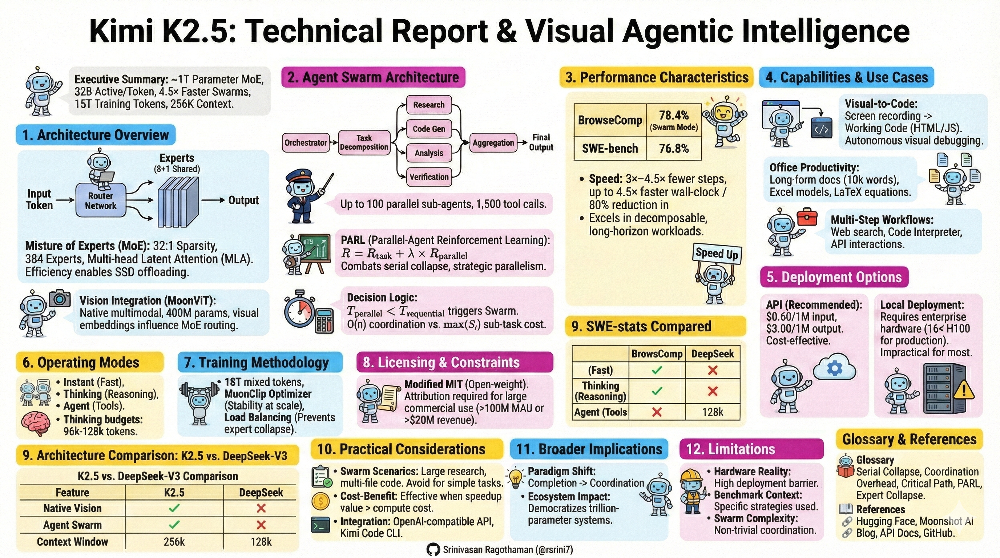
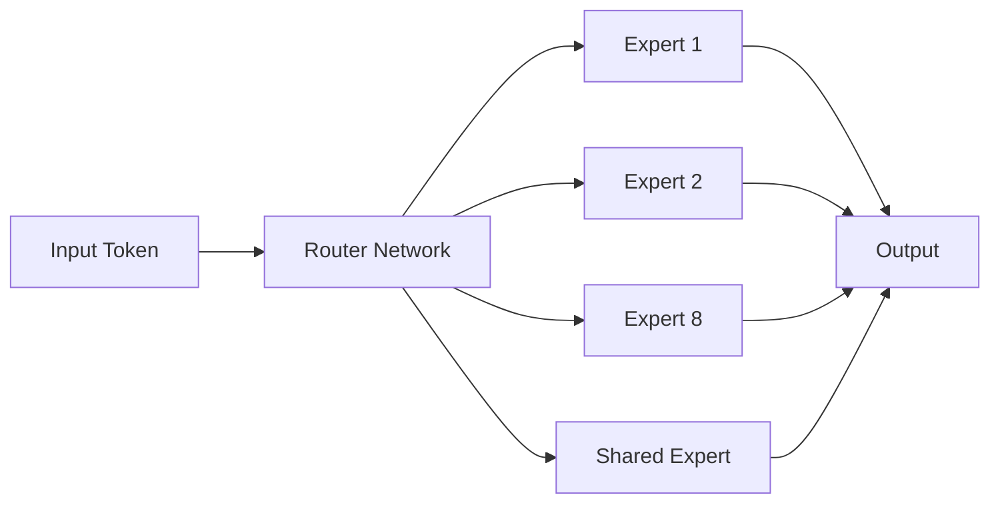
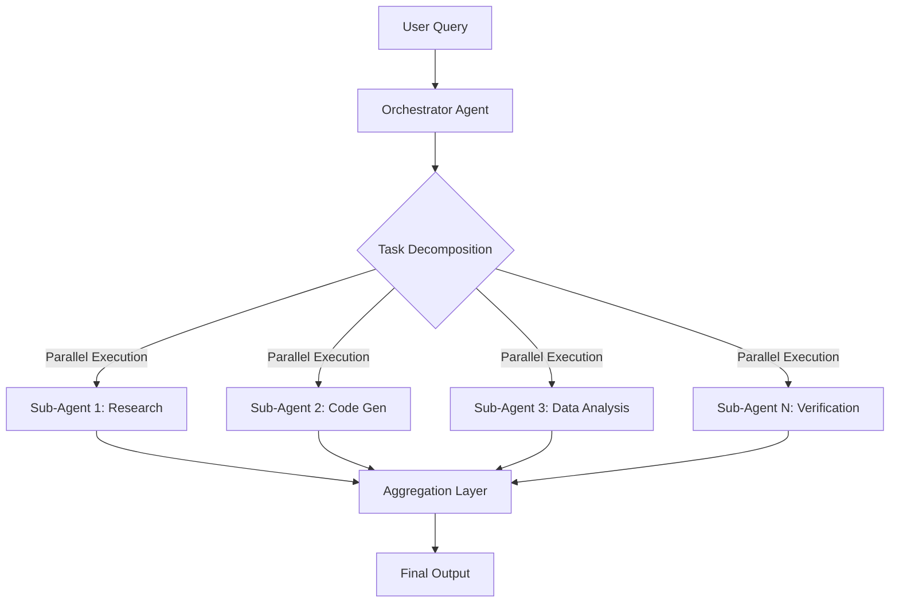

# Kimi K2.5: Technical Report
## Visual Agentic Intelligence and Agent Swarm Orchestration

**Version:** January 2026  
**Developer:** Moonshot AI  
**License:** Modified MIT License

---



---

## Executive Summary

Kimi K2.5 is an open-weight multimodal large language model built on an approximately 1 trillion-parameter Mixture of Experts (MoE) architecture. It represents a shift from single-agent systems to coordinated agent swarms, achieving up to 4.5× faster execution in decomposable, parallelizable workloads through Parallel-Agent Reinforcement Learning (PARL). The model excels at visual-to-code generation, autonomous debugging, and long-horizon workflows with up to 1,500 parallel tool calls.

**Key Specifications (as reported by Moonshot AI):**
- Total Parameters: ~1 trillion (MoE)
- Active Parameters: ~32 billion per token
- Training Data: Approximately 15 trillion mixed visual and text tokens
- Context Window: 256K tokens
- Expert Count: 384 experts (see Hugging Face model card)

---

## 1. Architecture Overview

### 1.1 Mixture of Experts (MoE) Design

Kimi K2.5 uses an ultra-sparse MoE architecture that activates only 32 billion of its 1.04 trillion parameters per token, achieving a 32:1 sparsity ratio.



**Architecture Details (as disclosed in technical briefings):**
- **Attention Mechanism:** Multi-head Latent Attention (MLA)
- **Model Hidden Dimension:** 7,168
- **Expert Hidden Dimension:** 2,048
- **Attention Heads:** 64
- **Transformer Layers:** 61
- **Top-K Routing:** 8 experts + 1 shared expert per token

**Efficiency Benefits:**
- 32:1 sparsity enables trillion-parameter scale at 32B activation cost
- Reduces VRAM requirements during inference
- Enables SSD offloading for inactive experts
- Maintains competitive performance with dense models

### 1.2 Vision Integration

Unlike models with bolted-on vision adapters, K2.5 features native multimodal architecture through the **Moon Vision Transformer (MoonViT)** with 400 million parameters.

**Vision Processing Pipeline:**
1. Visual inputs (images, videos, screenshots) → MoonViT encoder
2. MoonViT generates embeddings
3. Embeddings feed directly into MoE routing layer
4. Visual context influences expert selection

This tight coupling allows visual information to participate in reasoning and agent orchestration decisions, not just as passive input.

---

## 2. Agent Swarm Architecture

### 2.1 Core Concept

Traditional single-agent systems execute tasks sequentially. K2.5's Agent Swarm dynamically spawns up to 100 sub-agents for parallel execution across 1,500 tool calls.



**Responsibility Separation:**
- **Model (Planning):** Task decomposition, agent allocation, aggregation strategy
- **External Orchestrator (Execution):** Parallel tool calls, workload execution

### 2.2 Parallel-Agent Reinforcement Learning (PARL)

PARL addresses **serial collapse**, where models default to sequential execution despite parallel capabilities.

**Training Objective:**
```
R = R_task + λ × R_parallel

Where:
- R_task: Reward for output accuracy and quality
- R_parallel: Reward for effective parallelization
- λ: Decaying coefficient (starts at 0.1, decays to 0)
```

**Training Stages:**
1. **Early Training:** High λ encourages exploration of parallel strategies
2. **Mid Training:** Gradual decay balances parallelism with quality
3. **Late Training:** λ → 0, retains parallelism only when beneficial

**Result:** Final policy uses parallelism strategically, not indiscriminately.

### 2.3 Critical Steps Decision Logic

K2.5 uses a critical path analysis to decide when swarm execution is beneficial:

**Sequential Execution Time:**
```
T_sequential = O(1) + Σ S_i
```

**Parallel Execution Time:**
```
T_parallel = O(n) + max(S_i)

Where:
- O(n): Coordination overhead (linear in agent count)
- S_i: Cost/complexity of sub-task i
- n: Number of agents
```

**Trigger Condition:**
```
Swarm activates when: T_parallel < T_sequential
```

This prevents unnecessary agent spawning for small or tightly coupled tasks.

---

## 3. Performance Characteristics

### 3.1 Benchmark Results

| Benchmark | K2.5 Score | Notes |
|-----------|-----------|-------|
| **BrowseComp** | 78.4% (swarm mode) | vs. ~29% human baseline |
| **HLE (with tools)** | 50.2% overall | As reported by Moonshot AI |
| **SWE-bench Verified** | 76.8% | Front-end coding specialty |
| **Office Tasks** | 59.3% improvement | vs. K2 Thinking |
| **General Agent Tasks** | 24.3% improvement | Multi-step workflows |

### 3.2 Execution Speed Improvements

**Agent Swarm Benefits:**
- **Critical Steps Reduction:** 3×–4.5× fewer steps vs. single-agent
- **Wall-Clock Time:** Up to 4.5× faster via parallelization
- **Runtime Reduction:** Variable reductions up to ~78% in specific decomposable workloads
- **Tool Call Capacity:** ~1,500 coordinated calls per session

**When Swarm Excels:**
- Wide, decomposable tasks (research, data extraction)
- Multi-domain analysis (100+ parallel searches)
- Large-scale refactoring
- Long-horizon workflows

**When Single-Agent is Better:**
- Sequential, stateful tasks (game development)
- Tightly coupled dependencies
- Small tasks where coordination overhead exceeds benefits

---

## 4. Capabilities and Use Cases

### 4.1 Visual-to-Code Generation

K2.5 can analyze screenshots and screen recordings to generate working code:

**Input:** Screen recording of web application  
**Output:** Complete HTML, CSS, Tailwind, JavaScript implementation

**Key Features:**
- Understands interaction logic from video (scroll animations, hover effects)
- Autonomous visual debugging (screenshot → code fix)
- Layout iteration based on visual feedback

### 4.2 Office Productivity

**Supported Operations:**
- Word document annotation
- Excel Pivot Tables and financial modeling
- LaTeX equations in PDFs
- Long-form outputs (10,000-word papers, 100-page documents)

### 4.3 Multi-Step Agentic Workflows

**Tool Integration:**
- Web search and browsing
- Code interpreter
- File manipulation
- Database queries
- API interactions

---

## 5. Deployment Options

### 5.1 API Access (Recommended)

**Pricing (as of January 2026):**
- Input: $0.60 per 1M tokens
- Cached input: $0.10 per 1M tokens
- Output: $3.00 per 1M tokens
- **Cost Comparison:** Up to ~8× cheaper than Claude Opus 4.5 (workload-dependent)

**Access Points:**
- Official API: platform.moonshot.ai
- Third-party: OpenRouter, Fireworks AI
- Integration: OpenAI/Anthropic-compatible API

### 5.2 Local Deployment

**Hardware Requirements:**

| Configuration | GPU Setup | VRAM | Cost | Performance |
|---------------|-----------|------|------|-------------|
| **Enterprise** | 16× H100 80GB | 1,280 GB | $500k-700k | Production-ready |
| **Professional** | 8× H100 80GB (INT4) | 640 GB | $250k-350k | Good performance |
| **Quantized** | INT4/INT2 | 25-80 GB | Variable | Degraded speed |

**Inference Engines:**
- vLLM (recommended)
- SGLang (recommended)
- Storage format: block-fp8 / compressed-tensors

**Reality Check:**
- Full weights: >600 GB
- Quantized (INT4): ~25-80 GB VRAM
- Consumer hardware (RTX 4090): 10-20 tokens/sec
- Mac Studio: Orders of magnitude slower than H100-class systems due to Thunderbolt bottleneck

**Recommendation:** Use API unless you have enterprise GPU clusters. Local deployment is impractical for most users.

---

## 6. Operating Modes

| Mode | Description | Use Case |
|------|-------------|----------|
| **Instant** | Fast responses, minimal reasoning | Quick queries, factual answers |
| **Thinking** | Extended reasoning with token budget | Math, logic, complex analysis |
| **Agent** | Single agent with tool access | Web search, file operations |
| **Swarm (Beta)** | Up to 100 parallel sub-agents | Research, bulk processing, synthesis |

**Mode Configuration:**
- Testing context: temperature=1.0, top-p=0.95, 256k context
- Thinking budgets (benchmark configurations):
  - **96k tokens**: HLE, AIME benchmarks
  - **128k tokens**: IMO, coding benchmarks
- Note: Budget allocation in production may vary by task and mode

---

## 7. Training Methodology

### 7.1 Training Data

- **Volume:** Approximately 15 trillion mixed tokens
- **Composition:** Text, images, video
- **Base Model:** Continued pretraining from Kimi K2
- **Optimizer:** MuonClip (Muon + QK-Clip)

### 7.2 Stability Innovations

**MuonClip Optimizer:**
- Combines token-efficient Muon algorithm with QK-Clip stability mechanism
- Prevents attention logit spikes during training
- Achieved stable training at trillion-scale
- Enabled smooth scaling to 15T tokens

**Load Balancing:**
- Prevents expert collapse (overuse of popular experts)
- Ensures broad utilization across expert network
- Enables full trillion-parameter capacity utilization

---

## 8. Licensing and Constraints

**Modified MIT License:**
- Open-weight (weights on Hugging Face)
- Attribution required for large-scale commercial use:
  - Products with >100M monthly active users (MAU), OR
  - >$20M USD monthly revenue
- Must display "Kimi K2.5" in user interface when applicable

**Access Tools:**
- Kimi.com web interface (4 modes)
- Kimi App (mobile/desktop)
- Kimi Code CLI (VSCode, Cursor, Zed integration)
- API (OpenAI-compatible)

---

## 9. Architecture Comparison

**Note:** Comparison based on publicly reported specifications. See References section for sources.

### K2.5 vs. DeepSeek-V3

| Feature | Kimi K2.5 | DeepSeek-V3 |
|---------|-----------|-------------|
| Total Parameters | ~1T | ~1T |
| Active Parameters | 32B | ~37B |
| Experts | 384 | 256 |
| Attention Mechanism | MLA | MLA |
| Context Window | 256k | 128k |
| Vision Native | ✓ (MoonViT) | ✗ |
| Agent Swarm | ✓ (PARL) | ✗ |

**Primary Distinctions:**
- K2.5 emphasizes native vision integration vs. adapter approach
- Higher expert count enables better task specialization
- Extended context window (256k vs. 128k)
- Agent Swarm capability for coordinated parallel execution

---

## 10. Practical Considerations

### 10.1 When to Use Agent Swarm

**Ideal Scenarios:**
- Large-scale research across domains
- Multi-file code generation with dependencies
- Parallel data extraction/processing
- Complex document generation
- Wide search operations (100+ domains)

**Avoid Swarm For:**
- Simple, atomic tasks
- Sequential game/story development
- Tightly coupled workflows
- Tasks where coordination exceeds execution cost

### 10.2 Cost-Benefit Analysis

**Swarm Economics:**
- 100 agents = 100× compute burn
- 4.5× speedup requires coordination overhead < 96%
- Effective when: (speedup × value of time) > (extra compute cost)

**Practical Breakeven:**
- Research tasks: Usually beneficial (time-sensitive)
- Code generation: Mixed (depends on complexity)
- Simple queries: Not beneficial (overhead dominates)

### 10.3 Integration Patterns

**API Integration:**
```python
# OpenAI-compatible endpoint
client = OpenAI(
    base_url="https://platform.moonshot.ai/v1",
    api_key="your_api_key"
)

response = client.chat.completions.create(
    model="kimi-k2.5",
    messages=[{"role": "user", "content": "Your prompt"}],
    temperature=1.0,
    top_p=0.95
)
```

**Kimi Code CLI:**
- Terminal-based coding assistant
- Multi-editor support (VSCode, Cursor, Zed)
- Image/video input support
- Auto-discovers local tools/MCPs

---

## 11. Broader Implications

### 11.1 Paradigm Shift

K2.5 represents evolution from:
- **Text completion** → **Coordination systems**
- **Single agents** → **Orchestrated swarms**
- **Sequential execution** → **Parallel workflows**
- **Benchmark performance** → **System-level reasoning**

### 11.2 Ecosystem Impact

**Moonshot AI Context:**
- Valuation: ~$4.8B (post-2025 funding round)
- Focus: Practical deployment, efficiency, autonomy
- Strategy: Open weights for community innovation

**Global Implications:**
- Enables AI hubs (Bengaluru, etc.) to leverage frontier models
- Challenges closed-source dominance (GPT, Claude)
- Democratizes access to trillion-parameter systems
- Shifts competition to orchestration vs. raw scale

---

## 12. Limitations and Considerations

### 12.1 Hardware Reality

- "Open-source" with $500k deployment barrier
- Consumer hardware unsuitable for production use
- API dependency for most users
- Quantization trades speed for accessibility

### 12.2 Benchmark Context

- Internal benchmarks use specific strategies (e.g., swarm mode for BrowseComp)
- Independent validation confirms many claims
- Performance may vary in real-world deployment
- Gemini 3 Pro is superior on MMMU-Pro and VideoMMMU benchmarks
- Third-party tests (Hacker News, Reddit, Fireworks AI) validate agent capabilities

### 12.3 Swarm Complexity

- Not "magic" – parallel LLM instances on decomposed tasks
- Coordination overhead varies by task structure
- Benefits require careful task selection
- Learning curve for effective swarm prompting

---

## Glossary

**Serial Collapse:** Failure mode where models avoid parallelism, defaulting to slow sequential execution despite having parallel capacity.

**Coordination Overhead:** Time and computational cost required to spawn, synchronize, and aggregate results from multiple agents.

**Critical Path:** Longest sequence of dependent steps that determines total task completion time (from project management theory).

**MoE (Mixture of Experts):** Architecture where only a subset of parameters activates per token, improving efficiency while maintaining capacity.

**PARL:** Parallel-Agent Reinforcement Learning – training methodology that teaches models when and how to use parallelization effectively.

**Expert Collapse:** When routing favors few experts, leaving others idle and underutilized.

---

## References

**Official Sources:**
- **Hugging Face Model Card**: https://huggingface.co/moonshotai/Kimi-K2.5
  - Architecture specifications (384 experts, layer configuration)
  - Licensing details
- **Moonshot AI Technical Blog**: https://kimi.moonshot.cn/blog/kimi-k2.5
  - PARL methodology
  - Benchmark results (BrowseComp 78.4%, SWE-bench 76.8%, HLE 50.2%)
  - Training methodology (MuonClip optimizer)
- **API Documentation**: https://platform.moonshot.ai/docs
  - Pricing: $0.60/M input, $0.10/M cached, $3.00/M output (Jan 2026)
  - API integration guides
- **Official Repository**: https://github.com/MoonshotAI/Kimi-K2.5
  - Model weights and quantization guides
  - Deployment examples

**Additional Resources:**
- Moonshot AI company website: https://www.moonshot.ai
- Kimi Code CLI documentation
- Third-party evaluations (Fireworks AI, HuggingFace community)

**Note:** As of January 2026, benchmarks based on official release disclosures. Performance may vary with quantization strategy and future updates. Verify latest specifications from official sources.

---

**Document Version:** 1.0
**Last Updated:** January 2026  
**Target Audience:** Developers, Solutions Architects, AI Engineers

**Related:**
- [MiraThinker-1.5](MiraThinker-1.5.md) — Companion open-agent read: Kimi K2.5 orchestrates visual-to-code swarms while MiroThinker emphasizes verified single-agent research.
- [AI-Coding-Loops](../../AI-ML/Agents/development/AI-Coding-Loops.md) — Maps Kimi's PARL agent-swarm and 1,500-tool-call loop onto practical agentic coding workflow patterns.
