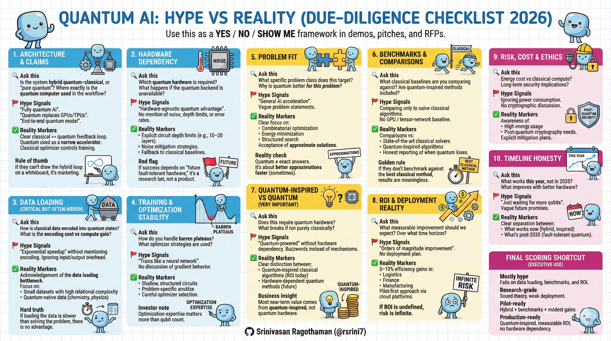

# Quantum AI Explained for Decision-Makers (2026)  

**With Built-in Hype vs Reality Due Diligence**

---

---

### Executive Summary — Reality First  
Quantum AI is not a replacement for classical AI. In the NISQ (Noisy Intermediate-Scale Quantum) era, it exists only as hybrid quantum–classical systems, where quantum processors act as specialized accelerators for narrow, high-complexity problems.  

**2026 Reality**  
- Near-term value: Hybrid optimization + quantum-inspired classical algorithms  
- No production-scale, end-to-end quantum AI  
- Pure quantum advantage remains hardware-limited until post-2030  

**Hype Filter**  
Any claim of “fully quantum AI” for large datasets in 2026 should be treated as a red flag, often indicating marketing over engineering.  

### Bits vs Qubits — The 2026 Mental Model  

| Feature          | Classical Bit                  | Quantum Qubit                          |  
|------------------|--------------------------------|----------------------------------------|  
| State            | 0 or 1                         | 0, 1, or superposition                 |  
| Scaling          | Linear (sequential exploration)| Exponential state space                |  
| Stability        | High (room temp)               | Low (cryogenic, decoherence in ms)     |  
| 2026 Bottleneck  | Compute cost                   | Data encoding tax                      |  

**Reality**  
Qubits do not compute faster. They use interference to bias probability toward better solutions.  

**Hype Signal**  
“Exponential speedup” without mentioning input/output cost.  

### The Hybrid Model — The Only Path That Works in 2026  
All viable systems follow the same loop:  
Classical Compute → Quantum Circuit → Measurement → Classical Optimizer → Repeat  

**Why this is unavoidable**  
- Data Encoding Tax: Moving CSVs / SQL tables into quantum states often costs more time than the quantum computation itself.  
- Barren Plateaus: Gradients vanish as circuits scale; naïve optimizers fail.  

**Reality**  
The success of a quantum system depends more on classical optimizer design than qubit count.  

**Hype Signal**  
Vendors who cannot clearly explain where the classical optimizer sits.  

### Hardware Reality — 2026 Benchmarks (No Speculation)  
- IBM Nighthawk (Jan 2026): ~120 qubits (scalable to 360 via modules), ~7,500-gate capacity, domain-specific advantage (materials).  
- Quantinuum Helios: ~98 physical qubits with high-fidelity logical qubits (~50 logical).  
- The 2026 Wall: Noise limits practical circuits to ~20–50 layers.  

**Reality**  
Hardware enables experimentation, not general AI disruption. Benchmarks like quantum volume exceed 1M in leading systems. Post-2030 timelines hinge on scalable quantum error correction, which suppresses noise to enable reliable, large-scale computations beyond today's NISQ limits.  

**Hype Signal**  
Claims that “more qubits alone” unlock broad AI advantage.  

### What Actually Exists (Academically Accepted Categories)  
1. **Quantum-Inspired Classical Algorithms (Highest ROI Today)**  
   - Classical tensor-network and annealing methods  
   - Run on GPUs  
   - No quantum hardware required  

   **Reality**  
   - 10–20% efficiency gains in logistics, routing, finance (McKinsey: Up to $97B quantum tech market by 2035)  
   - Already deployed in Bengaluru ecosystems  

   **Hype Signal**  
   Calling these “quantum AI” without disclosure  

2. **Quantum Kernel Methods**  
   - Quantum feature mapping  
   - Classical classifiers (SVMs, kernels)  

   **Reality**  
   - Strongest theoretical path to advantage  
   - Best for small, highly complex datasets  

   **Hype Signal**  
   Applying kernels to large, unstructured data  

3. **Variational / Hybrid Quantum-Classical (The Workhorse)**  
   Examples: VQE, QAOA  

   **Reality**  
   - Industry standard for 2026  
   - Optimizer design > hardware specs  

   **Failure Mode**  
   Barren plateaus + poor optimizer = no learning. For example, a 2025 hybrid QAOA pilot for supply chain optimization failed due to barren plateaus, where gradients vanished mid-training, yielding no better results than classical heuristics despite 50-qubit hardware.  

### Regional Context — India’s “Quanta 2026”  
Under the ₹6,003 crore National Quantum Mission (NQM):  
- Indigenous 50–100 qubit processors targeted  
- Hubs: Indian Institute of Science (IISc, Bengaluru)  
- Focus sectors: pharma, materials, secure communications  
- Talent gap: From ~150 in 2023 to projected 500–700 production-ready quantum engineers nationwide by 2026  

**Reality**  
India is correctly prioritizing hybrid + simulation, not speculative AI. India's focus contrasts China's Jiuzhang dominance in photonics—prioritize collaborations.  

### Risks and Considerations  
- **Energy Cost**: Quantum systems like Helios can consume 40kW+, 10–100× the power of GPU clusters.  
- **Security**: Long-term cryptographic risk (post-quantum migration needed to protect AI data).  
- **Talent and Execution**: Shortages could delay Quanta 2026; scale to 10K experts via NQM training programs.  
- **Ethical**: Potential for quantum to amplify AI biases in optimization if not audited.  

**Hype Signal**  
Overlooking these as "minor hurdles" without mitigation plans.  

### Investment Implications — Hype vs Reality View  

| Area        | Reality (2026)              | Hype to Reject (Red Flags) | 2026 Examples                  |  
|-------------|-----------------------------|----------------------------|--------------------------------|  
| QML         | Narrow pilots               | General ML acceleration    | IISc pharma pilots             |  
| Optimization| Deployable hybrids          | Exact NP-hard solutions    | Airline routing via AWS Braket |  
| Simulation  | Strategic advantage         | “AI replacement”           | Battery materials via VQE      |  
| Inspired    | Immediate ROI               | “Not real quantum” dismissal| Finance tensor networks        |  

**Prioritize**  
- Hybrid pilots targeting 5–10% gains  
- Bottlenecks >12h classical solve time  
- Local NQM / IISc collaborations (for Bengaluru firms: Leverage IISc's NQM hub for pilots, amid local quantum startups—8 selected in 2025)  

**Avoid**  
- “100% Quantum AI” platforms  
- Claims without classical baselines  

### Practical Next Steps (Actionable)  
1. Identify one optimization bottleneck (>12h runtime).  
2. Run a quantum-inspired classical baseline first.  
3. Pilot hybrid workloads via AWS Braket or Azure Quantum.  
4. Measure gains vs best classical solver — not naïve baselines.  

### FAQ  
**Q: Is Quanta 2026 viable?**  
A: Targets 50-100 qubits, building on IISc hubs—early prototypes expected Q3 2026.  

**Q: What's India's edge?**  
A: NQM's focus on hybrids aligns with global leaders, with Bengaluru as a hub for pharma/materials pilots.  

### Final Due-Diligence Litmus Test  
If removing the quantum computer does not break the product, you are buying a classical algorithm — which may still be the right investment.  

### Closing Reality Check  
Quantum AI in 2026 is not about magic speedups.  
It is about carefully applied probabilistic accelerators inside classical systems.  
Those who win will:  
- Exploit hybrid architecture  
- Benchmark honestly  
- Treat quantum as infrastructure, not mythology

**Related:**- [VIO-40K-Arch-10K-Qubits](VIO-40K-Arch-10K-Qubits.md) — Provides the hardware scaling reality check behind the hybrid quantum-AI hype-filter claims.- [AI-in-Next-18-Months](../AI-ML/LLMs/economy/AI-in-Next-18-Months.md) — Complementary 2026 forecast framing for where quantum-AI fits versus classical AI deployment timelines.- [AI-Hardware-Chips-Explained](../AI-ML/Hardware/AI-Hardware-Chips-Explained.md) — Pairs with the hybrid-model discussion of classical GPUs acting as the optimizer for quantum circuits.- [QuantumComputer-Terms](QuantumComputer-Terms.md) — Defines NISQ, decoherence, and barren-plateau vocabulary used in the executive decision-maker framing.
